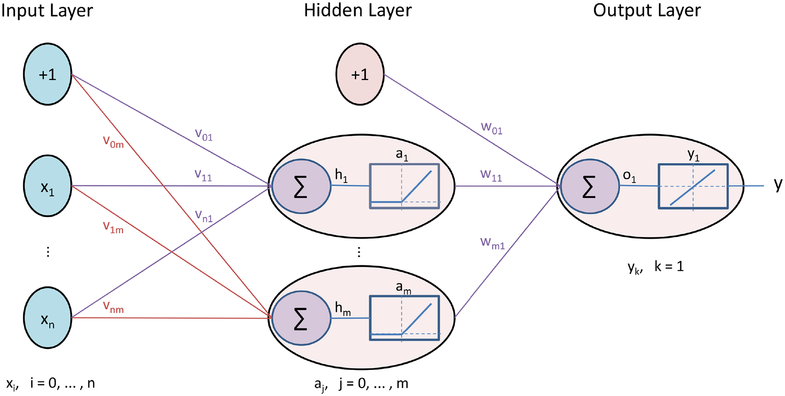
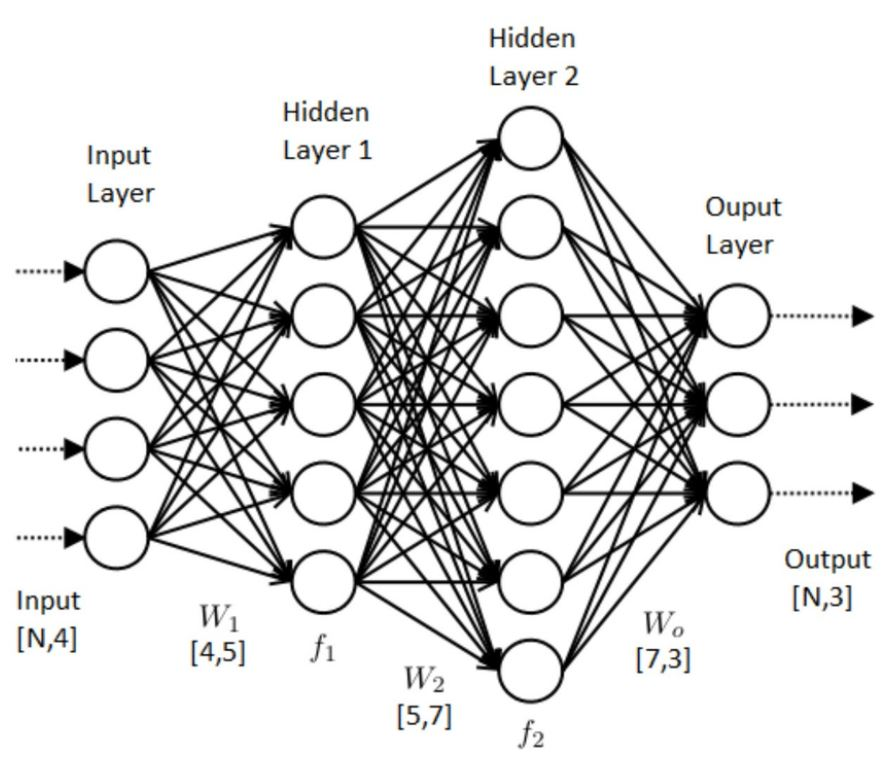
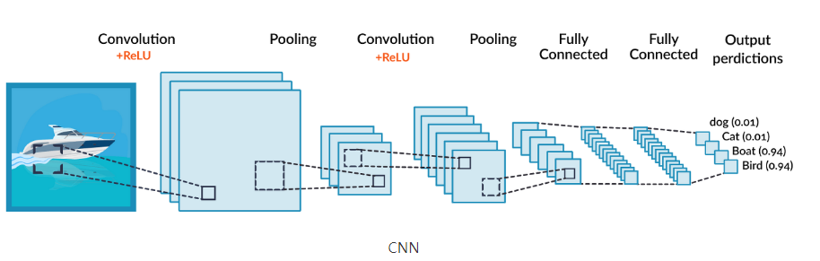
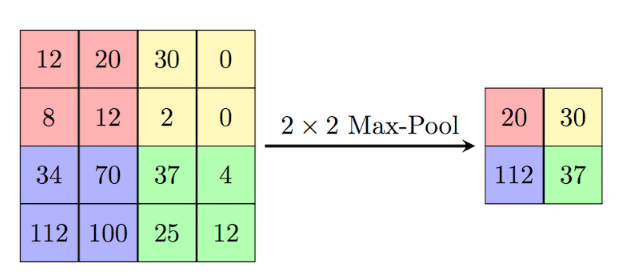
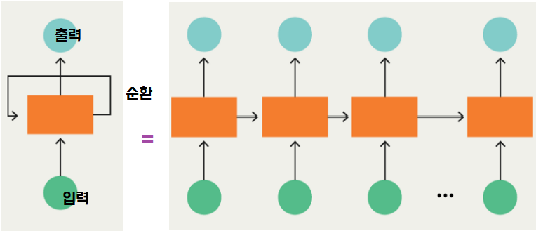

# 딥러닝(Deep Learning)

> 인간의 시신경 구조를 모방해서 추출과 분류의 기능이 특화되어 있고 문장분류나 얼굴인식 등에 잘 사용되는 `합성곱신경망(CNN)`
>
> 반복적이고 순차적인 데이터 학습에 특화돼서 음성인식이나 번역분야 등에 잘 사용되는 `순환신경망(RNN)`

* Imagenet : 전세계의 사진을 모아놓고 분류시키는 SW 대회 개최

* **딥러닝이 HOT한 이유?**
  * 다층의 Layer를 통해 복잡한 데이터의 학습이 가능하도록 함
  * 알고리즘 및  GPU 의 발전
  * 사람이 해야 하는 특징 추출을 기계가 함으로서 지속적인 학습이 가능하다.

## 인공 신경망

### ANN

> ANN((shallow Neural Network)
>
> * 사람의 신경망 원리와 구조를 모방하여(퍼셉트론) 만든 알고리즘
> * 연산이 깊어지다보니까 `Input Layer`에 대한 학습이 반영이 되지 않았다.
>   * 이러한 문제를 해결하고자 `DNN`이 등장하였음



### DNN

> DNN(Deep Neural Network)
>
> ANN기법의 문제를 해결하면서 모델 내 `은닉층(Hidden Layer)`을 늘려서 학습결과를 향상시켰다.
>
> 마지막 출력은 확률로 나온다. Output을 전부 다 합하면 100이 된다.
>
> 즉, 확률을 예측하는 과정이라고 생각하면 된다.



### CNN

> CNN(Convolutional Neural Network)
>
> * DNN에서 Convolution Layer를 포함하는 신경망
>
> * **이미지 인식**에 특히 높은 성능을 가진다. 다차원 데이터(*영상*) 분석에 주로 사용된다.
>
>   ex) 강사님의 마스크 쓴거 | 안 쓴거 구별하는 작업
>
> * 기존의 방식은 데이터에서 지식을 추출해 학습이 이루어졌지만, CNN은 **데이터의 특징**을 추출하여 특징들의 패턴을 파악하는 구조
>
> * **Convolution** 과 **Pooling**과정을 통해 진행된다.
>
>   * **Convolution(합성곱)** 은 데이터의 특징을 추출하는 과정으로, 각 성분의 인접 성분들을 조사해 피악하고, 파악한 특징을 한장으로 도출시킴
>
>   * **Pooling**은 `Convolution`을 거친 <u>데이터의 사이즈를 줄여 주는</u> 과정
>
>     ex) 정보추출, 얼굴인식,영상인식



* **Max Pooling**
  * 가장 큰 값만 추출 = 가장 큰 특징만 추출한다.



### RNN

> RNN(Recurrent Neural Network)
>
> * 반복적이고 순차적인 데이터 학습에 특화된 인공신경망
>   * LSTM, SEQ2SEQ 등 알고리즘
> * **시간의 흐름**에 따라 예측 값을 내는 **시계열 분석**에 사용된다
>   * 순환구조를 통해 과거의 학습을 현재 학습에 반영한다. (현재 학습과 과거 학습의 연결을 가능하게 한다)
>   * 시간에 따른 사용량 등 수치 데이터를 예측할 수 있다.
>   * 시간에 종속된다는 특징이 있어 주로 음성 인식이나 텍스트 앞 뒤 성분 파악할 때 사용됨
>
> ex) Chatbot, 번역, 자동 완성 등 주로 언어(**자연어**)에 관련된 분야에 활용된다.
>
> ex) 노래 가사를 기반으로 비슷한 내용을 가진 노래 추천
>
> ex) 넷플릭스 - 해시태그 참조하여 영화/드라마 추천




```markdown
# Wrapup
정답 - 라벨,타겟,Y값
분류는 그닥
confusion matrix
데이터가 불균형한 상황을 어케 처리하는지(Data Imbalanced)
비지도 - 군집화/ 차원축소
강화학습은 보상을 최대화하는 것이 목표다
(강화학습 단어 중요-Agent,Environment,Action,Award,State)
딥러닝은 인간의 신경망을 기반으로 만들어졌고
이미지 처리하는 CNN은 필터기반
데이터가 들어오는 순서에 따라서 학습을 하는 RNN
빅데이터가 기반이 되어야 딥러닝의 효율이 최대화가 된다.
99% ?? - 학습 정확도가 무조건 높다고 좋은 것이 아니라 다른 지표를 보고, 다른 데이터를 집어 넣어 결과가 어떻게 나오는 지 확인을 해야한다.
```

