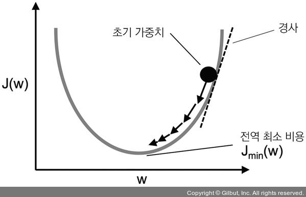

## 딥러닝

```markdown
# 머신러닝
알고리즘으로 데이터를 분석,학습하여 판단이나 예측을 하는 기술
데이터로부터 규칙을 찾아내는 역할을 `기계`가 담당
문체에 적합한 특징을 쓰지 않으면 좋은 결과 얻을 수 없다.

## 지도학습 (Supervised Learning) - 데이터 + 레이블(정답)
label = 정답, 실제값, 타겟, 클래스, y
분류모델(0과1)/예측모델(연속적인 문제)
* 모델 : 데이터들의 패턴을 대표할 수 있는 함수
* 함수의 입력은 독립변수이고, 출력은 종속변수로, 독립변수들에 의해 출력값이 정해진다
* 예측 모델의 손실측정함수는 **MSE** 
* 분류 모델의 손실측정함수는 Cross Entropy


## 비지도학습
레이블(정답)없이 진행되는 학습으로 데이터 자체에서 패턴을 찾아내야 할 때
군집화(clustering)/차원축소

* 선형회귀
* 로지스틱 회귀(S자 함수: 9과 1 사이의 값을 가짐)
* k-최근접 이웃
* 결정 트리
* 랜덤 포레스트
* 서포트벡터머신(SVM)
```

```markdown
# 딥러닝 
신경망은 이미지를 있는 그대로 `학습`하며 이미지에 포함된 중요한 특징까지도 `기계`가 학습한다.
```

* 사이킷런(Scikit-learn) : 가장 인기있는 머신러닝 패키지, 많은 머신러닝 알고리즘이 내장

### 심경신층망(DNN) 

입력층과 출력층 사이에 여러 개의 은닉층으로 이루어진 인공신경망

신경망 출력에 비선형 활성화 함수를 추가하여 복잡한 비선형 관계를 모델링할 수 있음

* | 활성화 함수(Activation function) | 출력 전에 활성화 함수를 두어 출력이 나올 수 있도록 하는 함수 |
    | -------------------------------- | ------------------------------------------------------------ |
    | Binary step                      | f(x) = 0 or 1<br />0보다 크면 1                              |
    | Logistic                         | 1/(1+e^-x)                                                   |
    | TanH                             | f(x) = tanh(x)<br />-1과 1 사이                              |
    | **rectified Linear unit (Relu)** | f(x) = 0 or x<br />- 인공지능 발전에 큰 영향                 |

* **오차 역전파** : 실제 값과 모델 결과 값에서 오차를 구해서, 오차(손실)을 줄이기 위해 퍼셉트론 모델의 `w` , **가중치를 업데이트** 하는 과정
  * 여러 노드 간의 연산을 통해 나온 최종 값과 실제 값의 차이를 보상해주기 위해 다시 피드백하는 과정
  * 한 번의 데이터를 학습하는 과정(`epoch`) : forward Propagation + Error Backpropagation

* **퍼셉트론** (perceptron) 모델 : 입력은 여러 개, 출력은 한 개인 모델
  * 사람 두뇌에 있는 뉴런을 모델링한 것으로 간단한 함수 학습 가능
  * `w` : 가중치
  * `b` (바이어스) ?: 실제 값과 추정치를 맞춰 주는 함수(차이를 풀어 주는 요소)

* **경사하강법**(Gradient Descent) : 뉴럴넷이 가중치 파라미터를 최적화하는 방법으로 손실함수의 `현 가중치`에서 `기울기(gradient)`를 구해서 `Loss를 줄이는 방법`으로 업데이트  해 나간다.
  * 기울기가 `0`인 지점 [ **손실이 가장 작은 지점** ]
  * 손실을 줄이는 건 퍼셉트론 모델에서 가중치를 업데이트 하는 것 의미



* **과적합(overfiting)** : 생성된 모델이 학습 데이터와 지나치게 일치하여 새 데이터를 올바르게 예측하지 못하는 경우
  * 과적합 방지하기 위한 방법 : `dropout` 
* **드롭아웃(dropout)** : 과적합을 방지하는 방법으로 단일 경사 스텝이 일어날 때마다 **특정 네트워크 레이어의 유닛을 고정된 갯수만큼 무작위로 선택하여 삭제**한다.

```markdown
1 Epoch : 모든 데이터 셋을 한 번 학습
1 iteration : 1회 학습
minibatch : 데이터 셋을 bach size 크기로 쪼개서 학습

* 총 데이터가 100개, batch size가 10이면, 1 iteration = 10개
* 1 Epoch = 100/batch size = 10 iteration
```

