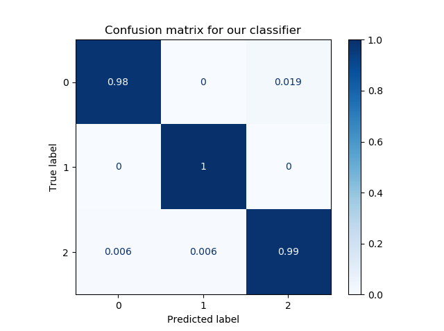
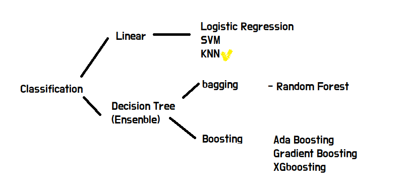
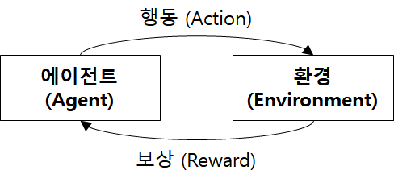
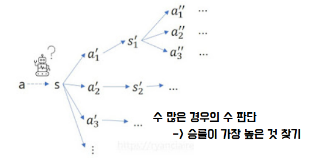

# 인공지능

> AI : Artificial Intelligence
>
> **인공**적으로 만들어진 **지능**적 행위
>
> (인간의 학습/추론능력을 컴퓨터로 구현)

| 인공지능                                    | 머신러닝                                                     | 딥러닝                                                       |
| ------------------------------------------- | ------------------------------------------------------------ | ------------------------------------------------------------ |
| 인간의 **지적 능력**을 컴퓨터로 구현한 기술 | 컴퓨터가 특정 부분을 **스스로 학습**하여 성능 향상<br />적절한 데이터와 알고리즘을 인간이 제시 | 인간의 뉴런과 비슷한 **인공신경망**으로 정보를 처리<br />사람이 해야 하는 특징 추출을 기계가 함으로서 지속적인 학습이 가능하다. |

| General  A.I - 인간이 할 수 있는 사고 | Narrow A.I - 한가지만 잘한다(일부분 적용) |
| :-----------------------------------: | :---------------------------------------: |
|           자비스, 아이로봇            |        알파고, 기가지니,얼굴 인식         |

* 학습분야
  * 인공지능 
    * 머신러닝 : 알고리즘을 입력하기 전에 필요한 특징을 사람이 직접 선정
      * 딥러닝 : 특징을 선정하는 부분까지 한꺼번에 학습한다.

* 인공지능 개요

  * 프로그래밍

    ```markdown
    Data(input)|-> Computer -> Output	
    Algorithm  |
    ```

  * 기계학습

    ```markdown
    Data(input)| -> Computer(ML) -> Algorithm 
    Output     |
    # 피드백을 입력하여 학습시킨다
    # 하지만 방법이 다소 제한되어 있다.
    ```

* 기계학습(Machine Learning)의 종류

  | 지도학습(Supervised Learning)        | 비지도학습(Unsupervised Learning) | 강화학습(Reinforcement Learning)                             |
| ------------------------------------ | --------------------------------- | ------------------------------------------------------------ |
  | 문제와 정답을 모두 알려주고 공부시킴 | 답을 가르쳐주지 않고 공부시킴     | 보상을 통해 상은 최대화<br />벌은 최소화하는 방향으로 행위 강화 |
| 예측/ 분류                           | 연관규칙(패턴) / 군집(클러스터링) | 보상                                                         |
  | 알파고(기보), 자율주행차             |                                   | 알파고(자가 경기)                                            |
  
  
  
* 지도학습 ( 문제지`data` + 답지 `label` )
  
    * `분류(Classification)` :
    
    ```markdown
    입력(데이터 or 사진) + **정답(label)** - (학습) => 예측 
      x(= feature/target)    y			
  ```
  
    ```markdown
    # 무슨 종류인지 모르는 데이터가 있을 때 어떤 종인지 구분하는 것이 기계학습의 목표!!
    * 모든 학습할 수 있는 데이터는 테이블 화가 되는 숫자들만 학습을 할 수 있다.
    	즉, 기계학습을 할 수 있는 건 테이블 형태여야 한다.
    * 사진이든 소리든 컴퓨터가 0,1로 인식을 하기 때문에 전부 수치화가 되는 것이다.
    ```

    ```markdown
    # 유방암 의심 환자의 검진 결과(데이터) + 양성 여부 (답)
    		x     |     o
    	   음성        양성
    # 이탈 고객 예측 - O / X
  # 위치 데이터 기반 고객 유형 분류 - 개인 / 개인 사업자 / 법인
    ```

    ```markdown
  * Confusion Matrix (혼동 행렬)
    잘못 예측했을 때의 발생 비용 예측.
    어떻게 예측했느냐에 따라 손이익이 달라지는 것을 판단할 수 있게 도와준다.
    ```
  
    
  
    
  
  ```markdown
    # Data Imbalanced 
  - Random Over Sampling  : 적은 데이터를 많게 만들어서 학습 시키기
    - Random Under Sampling : 많은 데이터를 적게 만들어서 학습 시키기
  	
    > 이러한 문제점을 해결하기 위해 `f1-score`라는 것이 생김
  	: 음성과 양성을 평준화시켜서 가장 좋은 상태를 선택한다.
  ```
  
    
  
    > CNN 등 원래 NN 은 `neural network`를 의미하지만, KNN에서의 NN은 🤩`nearest neighbor`을 의미한다.
  
    * 회귀

    ```markdown
  * 연속성 변수를 예측하는데 활용된다.
    * X축의 변수가 입력되었을 때 예상되는 Y값을 예측한다.
  * 이때 오차가 많아지면 다른 변수의 영향을 받고 있음을 예측할 수 있는데, 회귀분석을 통해 추세 파악은 할 수 있다.
    *ex) 네트워크 장비의 시간에 따른 트래픽/전력 변화량 예측*
    *ex) 서버는 뜨거워지면 중지 or 장애가 나기 때문에 냉방을 관리해주면서 비용을 절감할 수 있다.*
    ```
  
  * 비지도학습  (문제지`data`)
  
    * 군집화(Clustering)
  
    ```markdown
    
    ```
  - 비슷한 데이터들을 군집으로 묶는 알고리즘
    
    - 각 데이터의 특징/특성이 비슷하 경우 군집을 형성
  - 실제 상황에서는 2차원이 아닌 N차원 데이터가 다수이며, 그림으로 표현이 불가능하다.
    - 답을 학습/검증하지 않기 때문에 모델링 완료 후 신뢰성 검증이 어렵다.
    따라서, 정확도가 요구되는, 중요한 예측보다는 Risk가 크지 않은 경우에 주로 사용된다.
  ex) 추천, 제안하는 것처럼 `아님 말고~` 하는 용도로 사용된다.
    - 군집단에서 이상 행동을 하는 것(outlier)을 추출하는 데 사용 or 해킹 시도 예측
  ```
  
    * 차원 축소(Dimensionality Reduction) 
  
    ​```markdown
    ```
- 기계 학습보다는 데이터 분석에 가깝다. > 비지도학습에 안넣는 경우도 많다.
    - 시각화나 데이터 특징 파악에 주로 사용된다.(눈으로 볼 때 직관적이다.)
ex) PCA, LDA 등이 있다.
    ```

    
  ```
  
* 강화학습 
  
    * 특정 행동(Action)을 시행한 뒤 상/벌에 따라 해야할 행동 학습
  
      
  
    * State는 현재의 상태를 의미 (시작 전/ 게임 중 / 게임 종료[성공/실패])
  
    * 수행할 수 있는 행동(Action)을 시행한 뒤, 상/벌에 따라 다음 행동을 학습
  
    * **알파고**의 경우 **승률**을, 타 게임에 적용된 강화학습의 경우 **점수**를 보상(reward)으로 설정하고 학습한다.
  
    
  
    