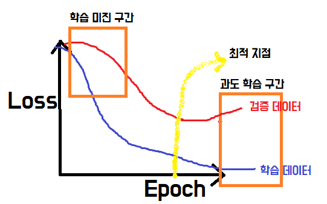

# 자율주행

```markdown
`AI`란 학습을 바탕으로 기계가 사람의 행동을 모사하는 것.
`머신러닝`이란 기계가 데이터를 이용하여 학습하고 그 학습 결과를 바탕으로 예측하는 것
```


> 자동차에 AI가 적용되어 사람의 도움없이 스스로 운전하는 것을 의미
>
> AI는 다양한 센서를 활용하여 **주변 환경 정보**를 수집하고, 운전자의 제어 없이 스스로 진행 방향과 속도 등을 조절하여 주행한다.

* AI가 카메라로부터 획득한 전방 영상을 바탕으로 도로 상태 파악

* 파악한 도로 상태를 바탕으로 직진/우회전/좌회전을 결정하여 주행 

  🐥 **지도학습**을 통한 분류, 예측이 적용되며 `ANN` 알고리즘을 활용하여 AI가 학습

## 자율 주행차 Kit

```markdown
# 사진과 방향키 조작정보가 텐서플로에 입력된다
# 사진을 원인값(x), 방향키 조작정보를 결과값(y)로 하는 모델 함수 방정식을 만든다.
# 방정식을 만들기 위해 AI기술인 `인공신경망(ANN)` 기술이 사용된다.
## 인공신경망에서 AI가 도로를 학습해 자율주행을 위한 훈련을 한다.
* `텐서플로` : 딥러닝과 머신러닝 등에 활용하기 위해 구글 내 인공지능 부문인 구글 브레인팀이 2015년 개발한 인공지능 툴
 * 텐서보드 :  텐서플로 시각화 도구
* `ANN(Artificial Neural Network)` : 인공 신경망, 두뇌의 정보처리 과정을 모방하여 만들어짐
# AI 자율주행차는 환경에 따른 사람의 행동을 학습시켜 이를 바탕으로 직접 주행하는 것이다.
```

* AI 주행 단계는 **도로 촬영  - 환경 파악 - 운전 결정 단계**로 진행된다.
* 인공신경망 기술은 **입력층, 은닉층, 출력층**으로 구성된다
  * 은닉층이 2단계 이상일 경우 **딥러닝**이라고 부른다.
  * 입력층에 다량의 데이터를 입력하면 <u>은닉층에서 정보를 학습</u>해 출력층에서 예측된 결과를 내놓는 방식
* 자율주행차 Kit
  * 머리 : 오렌지파이, Sd메모리, 카메라
  * 몸통 : 몸체판과 지지대, 배터리, 전선
  * 팔/다리 : 모터, 바퀴
* 자율주행차의 도로는 쉽게 만들어 점차 어려운 코스를 익혀나가는 방식으로 제작
  * 도로 폭은 AI 자율주행차의 1.5~2배 정도가 적당하다
  * 좁으면 운전이 어렵고, 넓으면 카메라가 좌우 양쪽 선을 포착이 어려워 학습이 잘 안된다.

## 인공지능 훈련 과정

* 다음 4단계를 반복한다.

| 1) 훈련 데이터 수집 및 정제                                  | 2) 인공지능 훈련                                             |
| ------------------------------------------------------------ | ------------------------------------------------------------ |
| 사람의 운전을 따라 배운다.<br />운전 조작을 통해 카메라로 계속 찍는다.(학습 데이터)<br />데이터는 양보다 질이다.<br />최대한 트랙에서 벗어난 데이터가 없도록 한다.<br />잘못 수집된 데이터는 삭제한다.<br />좌/우/직/정 데이터의 분포는 **균등**하게 (데이터 분포 조정)<br />방향키 값이 '0' 인 데이터는 정지를 의미하므로 삭제.<br />운전 미숙으로 인해  데이터 수집이 잘못되었다면 부분삭제 보다는 해당 세션 전체를 삭제 | 딥러닝에 필요한 데이터는 **훈련/검증/테스트** 데이터이다. <br />가장 중요한 데이터는 **테스트 데이터.**(최종)<br />훈련 : 검증 = 7:3 (or 8:2) <br />**훈련 손실이 완만**해지고 **검증 손실이 최저**일 때까지 학습한다. |
| **3) 성능 검증**                                             | **4) 훈련 현장 적용**                                        |
| 시뮬레이션을 통해 학습이 잘 되었는지 검증<br />결과 값 비교 분석<br />학습 결과 판정<br />정확도 `80%이상` 나올 때까지 훈련<br />(95% 이상은 과도 학습으로 운전자의 습관까지 따라하여 도로 이탈 가능성 O) | 주행 학습 결과 확인<br />종료 또는 반복 학습<br />실패 시 데이터 수집 - 데이터 보정 - 모델링 - 시뮬레이션 |

* 데이터 분포 조정

  1. 방향 데이터의 수량과 비율을 확인한다.

  2. 좌회전과 우회전 데이터 값을 균등하게 조정.(decalcom.py)

     * 좌우보다 직진이 많으면 많은 쪽으로 맞춘다. (upsampling)

     * 좌우보다 직진이 적은 경우 적은 쪽으로 맞춰 준다.

* 데이터의 종류

  * 훈련 데이터 : 인공지능이 스스로 학습하는데 사용하는 데이터

  * 검증 데이터 : 훈련 데이터를 통한 학습과 비교하는 용도로 활용하는 데이터

    ​					:point_up_2: 인공지능이 직접 활용X

  * 테스트 데이터 : 인공지능 훈련이 완료된 후, 잘 작동하는지 확인하기 위해서 사용되는 데이터

    ​					:point_up_2: 인공지능이 직접 활용X

* **작업단위(batch)** : 훈련 데이터(이미지)를 일정한 양으로 나눈 단위

  * 메모리의 용량이 한정되어 있기 때문에 많은 데이터를  한번에 모두 학습할 수 없음

  ```markdown
  # step = (data갯수 * epoch) / batch
  2000개의 데이터를 학습시키기 위해서는 100개씩 20세트로 쪼갠다.
  즉, 1 epoch를 학습시키기 위해서는 batch_size 100으로 20 step을 돌아야 한다.
  1 batch가 끝나면 모델은 파라미터를 조정한다. 
  - 이 과정이 1 step이다.
  ```

* **스텝(step)** : 한 작업 단위를 처리하는 것

* **에포크(epoch)** :  훈련 데이터 전체를 한번 훈련한 것 (**학습 횟수**)

* **정확도(accuracy)** : 인공지능이 예측한 값이 실제 데이터와 얼마나 일치하는지

* **로스(Loss)** : 운전시 방향키 값과 예측한 방향키 값의 차이

  * Loss가 :arrow_up: : 인공지능이 예측한 값과 실 운전 값 차이가 크다

* **학습미진구간** : `Trainging Loss`와 `Validation Loss`가 모두 크다

  * 훈련 데이터 학습이 제대로 안되었으니 검증 데이터 예측도 못함

* **최적지점** : `Traing Loss`와 `Validation Loss` 모두 낮다

  * 일반화가 잘 된 상태

* **과도학습구간** : 최적지점을 지나 `Traing Loss`와 `Validation Loss`의 차이가 증가하는 상태

  * 인공지능이 훈련 데이터에 너무 최적화되어 비훈련 데이터에 대해서는 예측을 X

