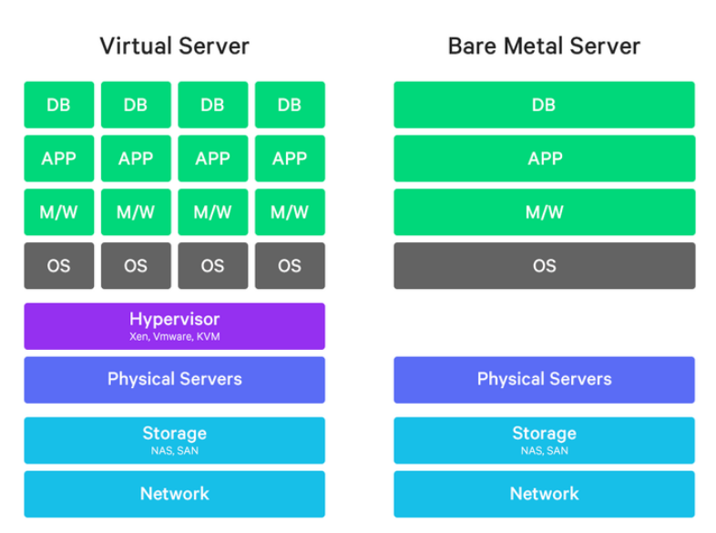

# Cloud

## Bare Metal

> 클라우드 환경은 크게 호스트형 가상화 방식과 베어 메탈 방식으로 나누어 진다. 
>
> - NCP, AWS와 같은 호스트형 가상화 방식 : HW 위에 하이퍼바이저 OS를 설치하고 그 위에 가상 서버를 구현하는 방식
> - 베어 메탈 서버는 HW위에 하이퍼바이저 OS없이 고객이 설치하고 싶은 OS를 직접 HW 위에 설치하는 방식
>   - HW의 리소스를 공유하는 가상화 방식과는 다르게 HW의 모든 성능을 사용할 수 있는 방식
>   - 즉, 운영체제가 설치되어 있지 않은 서버

* 베어 메탈 서버(**Bare Metal Server**) : 클라우드 환경에서 편리하게 고성능의 물리 서버를 관리할 수 있다. 
  * 서버에 대한 모든 권한을 가질 수 있고 서버의 모든 성능을 사용할 수 있으며 독립적으로 사용하기 때문에 웹 호스팅에 비해 보안 측면에서도 유리하다.

* 레거시 시스템(Legacy System) : 낡은 기술, 낡은 방법론, 과거로부터 내려온 컴퓨터 시스템, SW, HW를 의미.
  * 대기업은 중요한 업무를 처리하는 레거시 응용프로그램과 DB를 가진다.

## Load Balancing

* `Scale-up` : Server가 빠르게 동작하기 위해 HW 성능을 올린다
* `Scale-out` : 하나의 Server보다는 여러 대의 Server가 나눠서 일을 한다.
  * HW 향상하는 비용보다 서버 한 대 추가 비용이 더 적다
  * 여러 대의 Server로 인해 무중단 서비스 제공 가능!
  * 이렇게 **여러 대의 Server에게 균일하게 Traffic을 분산 시켜주는 것**이 `Load Balancer`다.

>  `Load Balancer`는 하나의 인터넷 서비스가 발생하는 트래픽이 많을 때 여러 대의 서버가 분산처리하여 서버의 로드율 증가, 부하량, 속도저하 등을 고려하여 분산처리하여 해결해주는 시스템.

:star2: **Load Balancer의 주요 기능**

* NAT(Network Address Translation)
  * 사설 IP 주소를 공인 IP 주소로 바꾸는 데 사용하는 통신망의 주소 변조기
* Tunneling
  * 인터넷상에서 눈에 보이지 않는 통로를 만들어 통신
  * 데이터를 캡슐화해서 연결된 상호 간에만 캡슐화된 패킷을 구별해 캡슐화를 해제
* DSR(Dynamic Source Routing protocol)
  * 로드 밸런서 사용 시 서버에서 클라이언트로 되돌아가는 경우 목적지 주소를 스위치의 IP 주소가 아닌 클라이언트의 IP 주소로 전달해서 네트워크 스위치를 거치지 않고 바로 클라이언트를 찾아가는 개념입니다.

**L2**

- Mac주소를 바탕으로 Load Balancing

**L3**

- IP주소를 바탕으로 Load Balancing

**L4**

- Transport Layer(IP와 Port) Level에서 Load Balancing
- TCP, UDP

## 하이브리드 클라우드

> 하이브리드차(전기+가솔린)과 같이 private + public 섞어놓은 방식

|               Private                |                        Public                        |           Hybrid            |
| :----------------------------------: | :--------------------------------------------------: | :-------------------------: |
|         강력한 보안 및 통제          |    클라우드 관리 용이성 기술변화에 빠른 대응    | Private + public  장점 |
| 높은 운영 비용 기술 변화에 취약 | 유동적 비용  데이터가 외부에 존재하여 유출 Risk |     전문 운영 인력 필요     |

# 보안

## IPS

>  **IPS(Instrusion Prevention System) : 친입방지시스템**
>
> : 위해 트래픽을 차단해주는 솔루션으로, 공격탐지를 뛰어넘어 탐지된 공격에 대해 웹 연결을 끊는 등 적극적으로 막아주는 솔루션이다.
>
> 침입탐지 기능을 수행하는 모듈이 패킷을 일일히 검사하여 해당 패턴을 분석한 후, 정상적인 패킷이 아니면 방화벽 기능을 가진 모듈로 차단
>
> 일반적으로 IPS는 방화벽 내부에 설치(방화벽과 연동하여 공격 탐지)

cf) `IDS(Instrusion Detection System)` : 특정 패턴을 기반으로 공격자의 침입을 탐지

* IPS는 IDS에서 한 발 나아가 공격이 실제 피해를 주기 전에 미리 능동적으로 공격을  차단함으로써 공격 피해를 최소화해 준다.
* 기업 외부에서 내부 네트워크로의 침입을 방지해 준다.(**외부 침입방지**)
  * 유해 트래픽의 원천적인 차단!

## 방화벽(Firewall)

> **침입 차단 시스템**
>
> :: 네트워크에서 보안을 높이기 위한 1차적인 방법
>
> :: 기본적인 기능은 접근 제어 룰셋(Role Set)을 통해 이루어짐

* `방화벽`은 서로 다른 네트워크를 지나는 데이터를 허용 및 거부하거나 검열 또는 수정한다.

## IDS

> **침입 탐지 시스템**
>
> :: 시스템에 대한 원치 않은 조작을 탐지
>
> 설치 위치와 목적에 따라 **호스트 기반**과 **네트워크 기반**의 침입탐지시스템으로 나뉜다.

| Firewall                                  | IDS                             | IPS                                  |
| ----------------------------------------- | ------------------------------- | ------------------------------------ |
| 접근 통제, 인가                           | 침입 여부 감지                  | 침입 이전에 방지                     |
| 수동적 차단 및 내부망 보호                | 로그, 시그니처 기반의 패턴 매칭 | 비정상적 행위 탐지                   |
| 엄격한 접근 통제 인가된 트래픽 허용  | 실시간 탐지 사후분석 대응  | 실시간 대응 세션 기반 탐지 기능 |
| 내부자 공격 취약  네트워크 병목 현상 | 변형 패턴은 탐지 어려움         | 오탐 현상 발생 가능 고가 장비   |

## VPN

> **Virtual Private Network, 가상 사설망**
>
> 공중망을 통한 연결을 전용선처럼 사용하는 효과를 누릴 수 있도록 하는 것.
>
> 가상 네트워크로 사용자/장치가 직접 연결된 하나의 개인 네트워크에 있는 것처럼 데이터를 보내고 받을 수 있도록 확장된 개인 네트워크

