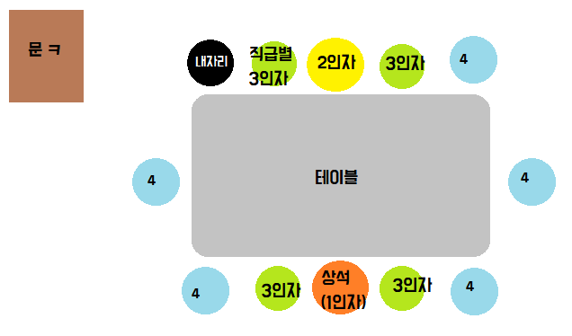

# 비즈니스 매너

### 신입사원 기본 매너

* 활기찬 인사
  * 기다리지 않고 먼저 인사 / 30분 먼저 출근
* 배우려는 자세
* 부지런하고 성실한 태도
* 하나를 알려주면 열을 아는 센스
  * 질문과 피드백 기억하기
  * 상황별 센스있게 대응하기

### 기본 매너

1. 출근할 때
   * 인사가 부담스럽다면 30분 빨리 출근하기
2. 퇴근할 때
   * "내일 뵙겠습니다." "즐거운 저녁 보내세요"
   * "수고하세요" "고생하세요" X "**먼저 들어가 보겠습니다**"
3. 걸어가다가 만났을 때
   * 인사 직후 등을 돌리지 않는다
4. 예상치 못한 곳에서 만났을 때
   * 상사가 혼자 있을 때 : 가벼운 목례
   * 사외 인사와 함께 있을 때 : 멈춰 서서 정중하게
   * **절대 놀라지 않는다.**
5. 악수 
   * `무장해제`라는 유래에 따라 왼손잡이라도 **오른손 사용**
   * 왼손으로 손목이나 팔꿈치를 받치는 <u>두 손 악수는 글로벌 기준에 어긋남</u> *(한국, 베트남에만 존재)*
6. 명함 교환
   * **건네기 전**에 자리에서 일어나 가벼운 인사와 함께 공손히 전달
   * **건넬 때**는 글자는 상대방을 향하고, 손가락으로 가리지 않는다
   * 건네는 순서는 **아랫사람이** 윗사람에게 먼저, **방문자가** 먼저, 여럿일 경우 **상사가** 먼저
   * 받은 후에는 바로 집어넣지 않고 확인하기. 낙서는 No
7. 통화
   * 전화가 오면 벨이 3번 이상 넘어가지 않도록
   * 받을 때에는 명확하고 상냥하게 소속과 이름을 밝힌다
   * 메모할 때는 한번 더 메모 내용을 재확인
   * 끊을 때에는 상대방보다 늦게 수화기를 내려놓는다.(3초의 미학)

### 입사 후 당황하는 순간

1. 전화 받은 후, 해당 업무 담당자 모를 때

   * 팀/ 담당 내 주요 업무 파악
   * KTalk조직도 상 직원별 사무분장 파악

2. 약속 있는데 회식 잡혔을 때

   * 사유와 함께 정중히 말하기 

     **but, 본인 환영회인 경우 필히 참석!**

3. 선배가 하는 업무용어 못알아 들을 때

   * 주간보고 및 업무매뉴얼 용어 사전에 찾아보기
   * 그때 그때 질문 및 정리

4. 배치 받고 며칠 간 특별한 업무 없을 때

   * 이메일을 통해 소속 부서에 자기소개(학교X, 지역X, 전공 O)
   * 관심 내용 ktedu.kt.com 미니 강좌 학습

**첫 출근 시**

1. 구성원 전원 연락처 저장 - 수신 시. " 네 과장님" 하고 받기 ^^
2. 사수가 없다면 매뉴얼, 업무 관련 서류 뒤적거리기
3. 무응답 No! 대답 잘하기

## :star: 비즈니스 용어

> TPO : TIME/ PLACE/ OCCAION (복장 매너 3 Point )

| ASAP          | 가능한 한 빠른                                 | FW            | 전달(포워딩)                   | TFT           | 여러 부서와 협업이 필요한 경우               |
| ------------- | ---------------------------------------------- | ------------- | ------------------------------ | ------------- | -------------------------------------------- |
| **CC**        | '관찰자'로 수신하는 사람 [메일 수신자 X]       | PM            | 프로젝트 진행자                | **FYI**       | 참고할 내용                                  |
| BCC           | 숨은 참조                                      | **R&R**       | 수행하는 역할과 업무 책임 범위 | **TBD**       | 추후 결정 예정인 내용                        |
| **Follow-up** | [후속 작업] 지속적 확인과 관리 필요            | Stakeholder   | 이해 관계자                    | RFI/RFP       | 정보요청서/제안요청서                        |
| Agenda        | 완수해야 하는 업무 내용을 사전에 정리해둔 항목 | **Consensus** | 합의, 동의                     | **Milestone** | 중요한 업무 진척도 관리하기 위한 업무 진척표 |
| **KPI**       | 달성하고자 하는 **목표 수치**                  | Arrange       | 내용 정리, 미팅,일정 반영      | **pending**   | 보류 및 중지된 상태                          |

## 이메일

* RE 형식 답장은 최소화
* 메일이 길어지면 중요한 부문 **볼드체**
* 글씨 색상은 **3개 이하**
* 이메일 하단 첨부할 서명 만들기 - 이름,소속,직위,연락처,홈페이지
* 제목만 보고도 용건을 **한눈에 파악**할 수 있게
  * (제목없음) : XXXXXXX
* 결론부터 간략하게 적기(두괄식)
* 첨부파일만 믿지 말고 내용 요약하기
* 메일 내용과  **관련된 모든** 사람 참조

## 회식

1. 첫 잔은 윗사람에게 권하고, 승낙 후 다음 잔 채우기
2. 따를 시, 오른손은 병의 중간,왼손은 오른쪽 팔목을 받친다
3. 건배 시 윗사람보다 술 잔 높게 들지 않는다
4. 마실 때는 상체와 고개를 돌려 소리가 나지 않도록 마신다

## 의전 매너

1. 안내시 귀빈보다 2~3보 앞에서 안내
2. 좌석 배치시에는 입구에서 먼, 전망이 좋은, 안전한 자리가 상석
3. 자동차 탑승 시 기사가 있다면 직원이 앞자리 탑승
4. 엘베 탑승 시 먼저 탑승, 늦게 하차

## 협업 매너

**업무 요청 스킬 - 상대방 관점에서 업무 요청**

1. **양해의 메시지** 먼저 : 양해를 구하는 라벨을 붙여 존중의 의미 전달
2. `WHY YOU` 설명 : 한가해서가 아닌 `전문가라고 들었다`는 한 마디
3. `Rain Check` : 나중에 쓸 수 있는 티켓으로 서로 돕는 관계 어필

**세련되게 거절하기 ㅋ**

1. Sympath, 상황 공감 (요구는 거절, 욕구는 공감)
2. Sorry, 유감 표명 (사실 기반의 솔직한 사과)
3. Suggestion, 대안 제시 (요청에 끝까지 대응)

## 회사 밖, 매너가 필요한 순간

**경사**

1. 30분 전 도착.. 부모님/신랑 or 신부 인사..
2.  누군가 묻는다면 "네 엄청 친해요" 라고 답변...
3. 생색내지 않기
4. 하객 비율 맞추기

**조문**

* 남자 오른손 위/ 손을 눈높이로 / 왼쪽 무릎을 먼저 꿇는다
* 여자 왼손 위 / 바로 선 자세에서 무릎 꿇고 앉는다.

**SNS**

* 업무방과 동기방은 **배경 설정**으로 다르게 분리 시키기

* 직접 만나서 답장했어도 **단체톡방에서 한번 더** 답장하기...

  