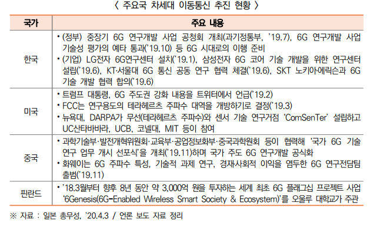

# 5G

[러시아 현황](https://news.kotra.or.kr/user/globalBbs/kotranews/782/globalBbsDataView.do?setIdx=243&dataIdx=185943)

[CES 리뷰](https://news.kotra.or.kr/user/globalBbs/kotranews/7/globalBbsDataView.do?setIdx=245&dataIdx=186904)

로컬 5G

private 5G

금년 상반기 중 6GHz 대역 기반 비면허 5G 표준이 확정될 것으로 전망되며 대형 제조업체를 중심으로 5G를 활용한 전용망을 확산할 방침

\- 스마트시티와 스마트팩토리 분야에서 사용될 6GHz 대역은 ’22년 상용화를 목표로 기술 개발을 진행

\- 6GHz 대역의 비면허 공급을 통해 사용자는 저렴한 비용으로 5G 콘텐츠를 소비할 수 있으며 기업은 비용 효율적으로 트래픽을 분산할 수 있을 것으로 기대

 우리 정부도 ’22년 상용화를 목표로 차세대 Wi-Fi에 6GHz 공급 추진

- [Wifi6](https://now.k2base.re.kr/portal/trend/mainTrend/view.do?poliTrndId=TRND0000000000039080&menuNo=200004&searchCate=&searchNate=&searchSubj=&sdate=&edate=&searchCnd=1&searchWrd=5G+&pageUnit=10&pageIndex=1)

 초기시장인 5G 융합서비스(실감콘텐츠･OTT 등)는 코로나19의 전 세계적 확산으로 언텍트가 일상화되면서 수요가 폭증, 새로운 전기 마련 - ‘슬기로운 코로나 생활’로 폭증하는 트래픽･데이터를 충당할 수 있는 5G 가치를 체감하면서 5G 융합서비스 수요가 급속히 증가

코로나가 5G의 발전을 더욱 촉진시킴!!