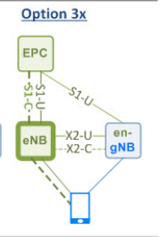

# 5G NR

> 5G = NR(new radio) 

```markdown
# 5G의 특성
1. eMBB(enhanced Mobile BroadBand): 광대역
	* 5G에서는 LTE보다 더 넓은 주파수 대역폭을 이용한 데이터 전송이 가능하다.
	* 주파수가 넓으면 Throughput이 잘 나온다
2. URLLC(Ultra-Reliable and Low Latency Communications) : 초저지연
	* 1ms radio latency
3. mMTC(massive Machine Type Communications) : 초연결성
	* 반경 100만km^2
	* IoT 전용 통신망(LoRA,NB-IoT)
```

* NR의 특징
  1. New spectrum band
  2. Flexible PHY
  3. MIMO/Beamforming
  4. URLLC/ mMTC
  5. **Flexbile Duplex** : NR의 강점(Dynamic TDD - 3.5GHz)
  6. New Channel Coding
* 5G가 진화되기 시작한 시점 : **release 15**(2017~2019)
  * 표준 완료 2019년
  * 한국에서 세계 최초 상용화
  * release 16, 17로 진화하게 됨
* 주파수 대역이 높으면 Path Loss가 많아지지만 빨라진다.

## [SA NSA](https://www.netmanias.com/ko/post/blog/14289/5g-lte/core-network-migration-paths-to-5g)

>  기존 `EPC`를 이용하거나 또는 `5GC`를 이용

* `SA`(Standalone) : 기존 RAT 연계 없 이 5G 서비스 지원 
* `NSA`(Non-Standalone) : 기존 LTE망과 연계하여 5G 서비스 지원

| 4G LTE                        | SA       | NSA                       |
| ----------------------------- | -------- | ------------------------- |
| Evolved Packet Core (**EPC**) | **5GC**  | **EPC+5GC**               |
|                               | Option 2 | Option 3X<br />main이 LTE |

* :star: `KT` 는 **Option 3X** 사용 중 : 데이터를 Split 시켜서 받는다

  * 양쪽에서 받을 경우 Throughput이 잘 나온다.
  * Option 3x - > Option2 사이의 단계에 있음 

  

* :star:NR 프로토콜

  > MAC - RLC - PDCP - **SDAP**
  >
  > * **SDAP**:  qos에 따라 분배 가능. 즉, LTE와 다르게 SDAP가 추가되는데 이게 어떤 단말을 먼저 서비스해줄 건지 판단해줄 수 있다.

* waveform

  * DL : CP-OFDM
  * UL : CP-OFDM + DFT-s-ODFM

* 주파수 범위

  * **FR1** : 6GHz 이하 / FDD / dynamic-TDD/semi-static-TDD
  * **FR2** : 6GHz 이상/ dynamic-TDD/semi-static-TDD

## Subcarrier spacing

> 고정되던 Subcarrier 가 **Flexible** 해짐(15*2^n)Hz
>
> Subcarrier 의 합 : OFDM

`Subcarrier spacing`에 따라서 서비스가 달라진다

* `Symbol Time`과 **반비례**

* `Subcarrier spacing`이 넓으면 `Symbol Time이 줄어든다.` :arrow_double_down:

  * `28GHz`에 유리함

  * `Loss`가 심하다

  * `URLLC 좋다. `

    :레이턴시가 적어 자동차 사고를 줄일 수 있다.

    *심벌(symbol)의 길이가 짧아질수록 동일한 데이터를 전송하는 시간이 짧아지므로 전송이 지연되는 시간이 줄어든다.*

* `Subcarrier spacing` 좁으면  `Symbol Time이 늘어난다.`
  * `NBIoT에 좋다`
  * `Loss` 적다.

## TDD

| LTE  | NR   |
| ---- | ---- |
| FDD  | TDD  |

* `5G FR Channer `구조
  * **DL+DL+DL+F+UL** = **DDDFU**
  * `F`는 가드타임 
  * F = **10D + F + 2U** (10:2) - Flexible Slot
  * 주파수 간섭때문에 통신 3사 DDDFU  똑같이 해주어야 한다.

## 빔포밍

> `빔포밍(Beamforming)`은 안테나에서 신호를 사방으로 유포하는 것이 아니라 특정한 수신 기기에 집중시키는 기술

| :star: 디지털 빔포밍                                         | 아날로그 빔포밍 |
| ------------------------------------------------------------ | --------------- |
| **모뎀**에서 처리                                            | **RU**에서 처리 |
| 정확하다                                                     | 부정확하다      |
| 통신 3사 모두 `PMI(precoding matrix indicator)`기반의 디지털 빔포밍<br />상용화된 `3.5G`는 디지털 빔포밍 | `28GHz`         |