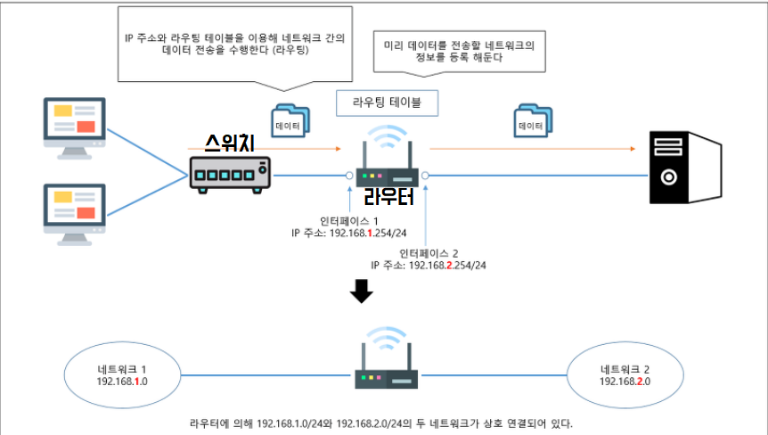

* **모뎀** : 변/복조기의 약자로, 디지털 네트워크 전송을 아날로그 형태로 변조해서 케이블을 통해 데이터를 효과적으로 전달한다.

* DSL : 디지털 가입자 회선
  * ADSL(비동기 DSL), VDSL(초고속 DSL)

* **액세스 포인트**(AP) : 무선 브로드 캐스트를 통해 무선 네트워크와 통신하고 기존 연결을 통해 이더넷 네트워크에 연결.
  * 기존 네트워크에서 들어오는 프레임은 기기가 연결된 액세스 포인트를 통해 모바일 장치로 릴레이된다.
  * 무선 기기는 AP(**브릿지** 역할)를 통해 통신한다.
* **802.11** OSI 데이터 링크와 물리 계층과 동일한 TCP/IP 스택의 네트워크 접근 계층을 차지한다.
* **802.11 보안**  : 무선 네트워크는 반경 내 어느 곳에서든 보안이 취약하다.
* **WEP**(Wired Equivalent Privacy, 유선 동등 프라이버시) 
  * 기존 유선 네트워크에서 제공하는 프라이버시와 동등한 수준으로 제공하기 위해 설계됨
  * 기밀 유지 / 무결성 / 인증

## 네트워크 장비

* `브릿지` : **물리 주소**를 기반으로 패킷을 필터링하고 전송하는 연결 장치이다.
  * OSI 데이터 링크 계층에서 작동
  * 네트워크 접근 계층 물리 주소를 사용하고 IP 데이터그램 헤더에 있는 논리 주소 지정 정보를 확인하지 않기 때문에, 다른 네트워크에 연결하는 데 유용하지 않다.
  * 대규모 네트워크에 데이터 전송하는 데 도움 x
* `허브` : 자신의 포트 중 하나에서 전송을 수신하고 해당 전송을 다른 모든 포트에 알리는 네트워크 장치로 진화했다.
  * 네트워크는 모든 컴퓨터가 단일 연속 회선을 상용해 연결된 것처럼 작동한다.*(단순 신호 수신 및 재전송)*
  * 네트워크 배선 단순화

* `스위치` : 허브 기반의 이더넷 네트워크가 트래픽 중가에 따른 성능 저하를 직면하자 이를 해결하고자 만든 것..

  * 스위치는 자신의 포트 중 하나로 수신한 데이터를 어디로 보내야 할 지 알고 있음

  * 즉, 원래 받아야 할 어댑터에만 프레임을 전송한다.

  * 불필요한 전송을 줄여 네트워크의 성능을 높인다.

  * **컷 스루**(cut-through) : 스위치는 목적지 주소를 얻자마자 프레임 전송을 시작한다.

  * **저장 및 전송** : 스위치가 재전송 이전 모든 프레임을 수신한다.

    :: 재전송 처리의 속도를 늦춰준다.

  * OSI  데이터 링크 계층에서 작동하는 기본 스위치 : **계층 2 스위치**

  * IP 주소를 기반으로 전송하는 스위치 : **계층 3 스위치**

### 스위치 vs 라우팅

> 스위치는 네트워크 내에서 트래픽을 관리하는 장치로 라우터를 서서히 대체한다.
>
> 이더넷은 트래픽이 많을 때 비효율적이며, 스위치는 네트워크 트래픽을 필터링하는 효율적인 방식을 제공해서 모든 장치가 모든 전송을 알 필요가 없다.

* 라우터는 물리 및 논리 주소를 해석해야 한다
* 스위치는 네트워크 접근 계층에서 물리 주소를 사용해서 모든 기능을 수행한다.(논리적 IP 주소 이해 X)

* `스위치`는 **로컬 네트워크**에 연결하여 효과적으로 트래픽을 관리하고, `라우터`는 인터넷 **인터페이스**를 제공한다.