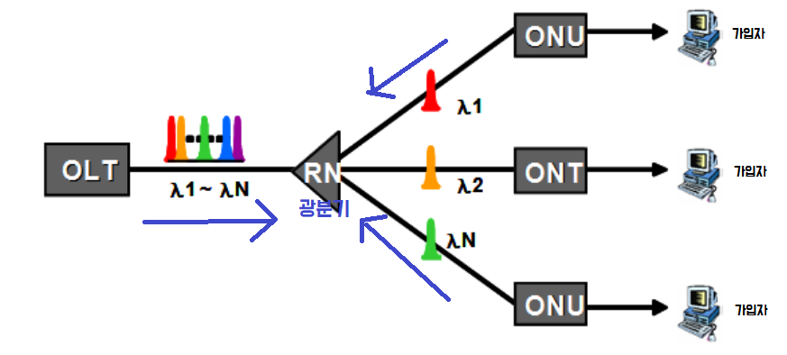
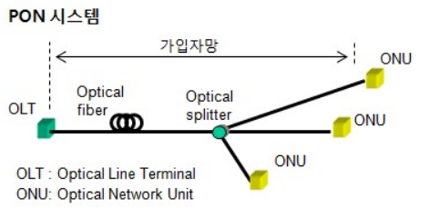

# FTTH

> 단순히 광케이블이 가정까지 연결되는 물리적 구조만이 아니라 TPS 제공을 위한 QoS 및 소요 대역이 보장되는 케이블 기반의 100M 급 이상의 가입자 네트워크 구조
>
> 전통적인 의미의 FTTH는 가정용 고객을 대상으로 케이블이 고객 댇내까지 공급된 액세스 네트워크로, 서비스에 대한 규정없이 물리적인 구조만 정의
>
> 동선 케이블을 광케이블로 대체를 의미하는 협의의 FTTH로 정의

## FTTH 출현 배경

**1) 대용량 멀티미디어 서비스로 패러다임 변경**

* 음성과 데이터의 통합, 유선 무선의 통합
* 통신과 방송의 융합
* 홈 네트워킹 등 가입자측 서비스 환경의 변화

**2) 현재 가입자망의 문제**

* ADSL, VDSL 등은 대역폭과 거리 제한 문제

  *비대칭 구조의 한계성과 거리 제한, 대역폭 제한 등*

* 멀티미디어 서비스 수용을 위한 대역폭 부족

* QoS 서비스 제공의 한계

* 새로운 부가가치 창출을 위한 IP-TV 서비스에 부적합

  *서비스의 패러다임 변화에 요구되는 IP-TV, 고화질, VOD, 화상 전화등은 충분한 대역폭과 QoS 보장이 필수적으로 선행되어야 한다.*

##  FTTH 분류

### 망 구성 방법

**Real FTTH**

* 국사에서 **가입자 댁내까지** 광케이블을 포설하여 직접 `ONT/ONU`까지 구성하고, `ONT/ONU`에서 가입자 PC로 `Ethernet `연결 구성
* 100M 급 이상의 대역폭 보장
* FTTR(Fiber to Run)이 가장 진보된 방식으로 일본에서 시범 서비스 중이다.

**Hybrid FTTH**(유사 FTTH)

* **가입자 인근까지** CELL을 기반으로 광케이블을 포설하여 설치
* 이곳부터 가입자 댁내까지 Ethernet 케이블 사용
* 100M 급 이상의 대역폭 보장
* FTTN, FTTP, FTTB, FTTS 등으로 불린다.

### 구현 기술 방식

> FTTH는 망의 전체 구조, AON이나 PON은 망을 구성하는 요소

**AON(Active Optical Network)**

* 망 구성시 중간 분배점 전원 필요(`Switch`기반의 **이더넷 가입자 망**)

**PON(Passive Optical Network)**

* 망 구성시 중간 분배점 전원 불필요(광가입자망 중간에 별도의 전원이 필요 없이 네트워크를 구성)

|                  | ATM-PON | Ethernet-PON(E-PON) | G-PON                      | WDM-PON     |
| ---------------- | ------- | ------------------- | -------------------------- | ----------- |
| Layer 2 Protocol | ATM     | Ethernet            | Native(ATM, Ethernet, TDM) | Transparent |
| Multiple Access  | TDMA    | TDMA                | TDMA                       | WDMA        |
| Cost             | 중간    | 낮음                | 중간                       | 높음        |
| QoS              | 좋음    | 나쁨                | 좋음                       | 매우 좋음   |

- kt는 `E-PON`으로 구성되어 있다.
- `WDM-PON`의 경우 QoS 구현이나 망의 대역폭, 품질 등이 가장 우수하지만 <u>CAPEX(초기투자비용)와 OPEX(운용유지보수비용)에서 경제성을 고려</u>해야 하므로 아직 활성화되지 못하고 있다.
- `E-PON`에 대한 표준은 IEEE 802.ah에서 표준 규격을 정의하고 있으며, 망측의 `OLT`, 가입자측의 `ONU/ONT`, `수동형분기기(RN)`으로 구성된다.

* 데이터의 Down Stream은 (OLT->ONT방향) **브로드캐스팅** 방식
* 데이터의 Up Stream은 (ONT->OLT방향) **TDMA**(Time Division Multiple Access)방식
* 하나의 광코아로 구성되며, RN을 거치면서 **1:N**의 분기 구조를 가진다.
  * 상향(ONT->OLT)으로는 1310nm 광파장
  * 하향(OLT->ONT)으로는 1490nm 광파장

* E-PON에서 OLT와 ONT 사이에 광전송로 구성시 가장 고려해야 할 사항은 **종단간 광손실**
  * 그 기준은 OLT부터 ONT단까지 총손실이 27dB를 초과하지 말아야 한다.

### RN

> RN의 주회로는 `PLC`로 구성되어 있다. 
>
> E-PON에서 사용되는 RN의 경우 `Splitter`와 `Combiner`의 역할이 병합되어 구성됨.
>
> * `Splitter` : 하나의 입력이 여러 개의 출력으로 분기되는 구조
>   * 가입자 인근에 2차 `Splitter`  배치로 인한 광케이블 회선 비용 감소
> * `Combiner` : 여러 개의 입력이 하나의 출력으로 분기되는 구조

**OLT (광선로 종단장치)**

   - 국사내에 설치되어 백본망과 가입자망을 서로 연결하는 광가입자망 구성 장치
           - 가입자 광 신호를 국사측에서 종단하는 역할

**ONU (광통신망 유니트)**

   * 주거용 가입자 밀집 지역의 중심부에 설치하는 소규모 옥외/옥내용 광통신 장치
   * 사용자(이용자)와 망과의 분계점
        * 사용자 망 인터페이스(UNI) 역할을 담당

**ONT (옥내광종단장치)**

   * 전화국사로부터 광케이블이 가입자 댁내까지 확장 포설되어 최종적으로 종단되는 장치

