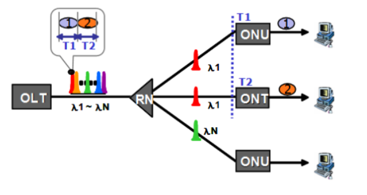

# E - PON

> `E-PON` 의 표준안인 802.ah EFM `MPCP` 프로토콜이 E-PON동작의 기본이다.
>
> `E-PON`에서 DownStream 데이터들은(OLT -> ONT) 802.3 이더넷 프레임 구조를 가지는 브로드캐스팅 방식이며, 하나의 광코어를 사용한다.
>
> **브로드캐스트** 방식으로 전송되는 데이터들을 ONT에서 수신할 경우 자신에게 고유하게 할당 되어 지는 `LLID`를 가지고 <u>선별적으로 받아들이게 되는 구조</u>로 동작된다.

* 유선 가입자망은 Air가 아닌 광케이블, 동축케이블, UTP 케이블 등의 매체로 Data를 전달하는 기술이다

* E-PON에서UpStream 데이터들은 TDM 방식으로 동작하며, 광파장은 1310nm를 사용한다.
* OLT에서 보내는 GATE Message를 기준으로 하여 Data 전송이 이루어지는데, 이것을 조정하는 역할을 MPCP에서 담당한다.
* TDM방식이므로 각각의 ONT들은 자기 자신에게 주어진 시간에만 데이터를 전송할 수 있으며, 만일 자신에게 주어지지 않은 Time Slot을 점유할 경우 다른 ONT에서 보내는 Data들과 충돌이 발생하게 되는 것이며 이것이 RN에서 Combiner 구조로 인한 방향성에 기인한다.
* 광케이블 사용으로 인한 빛의 간섭현상으로 인한 ONT간 광신호 충돌현상이 발생되고, 이것을 조정하는 역할은 Burst Modem라는 전송 방식으로 완화 또는 조정하게 된다.