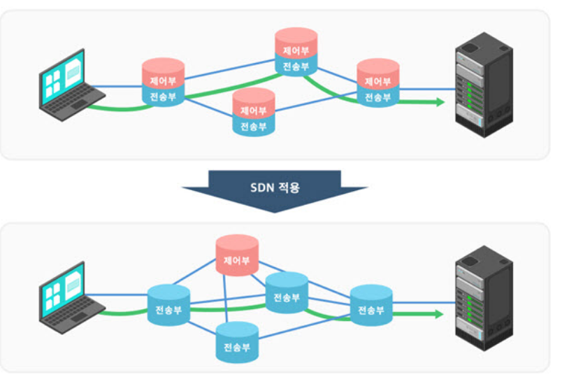

# SDN

> 네트워크 장비 내의 **제어부(Control Plane)와 전송부(Data Plane)의 분리**
>
> 제어부 : 네트워크 장비의 '뇌' - *라우터가 최적의 경로 계산* 
>
> 전송부: 손발의 역할

* Network 구조는 집중 구조에서 분산 구조 바꾸면서 지연을 줄일 수 있다.
  * 시스템은 전용 장비에서 범용 장비로



```markdown
기존의 라우터는 이웃하는 라우터로부터 각 경로의 혼잡 여부 등의 정보를 받아서 최적의 경로를 각 라우터 내에서 각각 계산한다.
이 때 SDN은 이러한 경로 계산을 위한 제어부와 데이터 전송을 위한 제어를 분리하여 하나로 집중한다.
SDN 이전의 장비들은 제어부와 전송부가 동일 장비 내에 존재하였으며, 데이터 전송 기술이 발전할 수록 여러 가지 전송 기술을 지우너하기 위해서 제어부가 굉장히 복합해진다.
라우터와 같은 네트워크 장비에 포함된 제어부와 전송부를 분리하고, 필요한 기능만 제어부에 탑재할 수 있게 해야 한다는 논의 및 연구가 시작됨 - 그 결과물이 `SDN`
# 라우터와 같은 네트워크 장비에 포함된 제어부와 전송부를 분리하고, 필요한 기능만 제어부에 탑재할 수 있게 해야 한다.
```

* SDN이 적용되면 제어부는 별도의 장비 또는 컴퓨터 서버로 분리되고, 네트워크 장비는 데이터 전송 기능만을 갖춘 전송부만 가지게 된다.