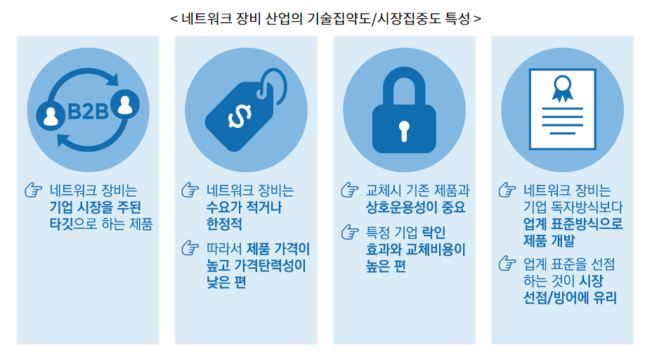
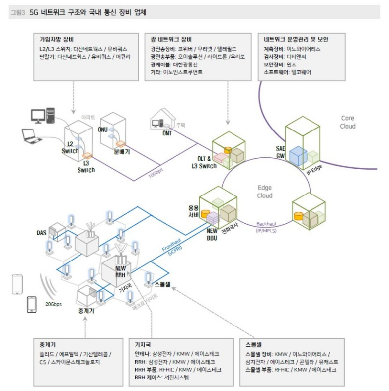

# 5G

이동통신 산업은 경제발전의 근간이 되는 기간산업 + 정부 규제 산업

1984년 1세대 이동통신 상용화 이후 `10년 주기`로 진화

:point_right:최근 데이터 트래픽 및 디바이스 연결의 폭발적 증가

:point_right:방송과 통신의 융합

:point_right:클라우드 활용 증대

-------> 새로운 통신기술에 대한 요구 증대

>  **IMT-2020**으로 기존 4G 대비 20배 빠른 초고속 / 통신 지연이 10배 짧아지는 **초저지연** / 연결 기기가 10배 많아지는 **초연결**

* 5G는 다양한 산업의 생산성 및 혁신을 촉진할 것

*  이동통신 장비 산업은 **화웨이, 에렉슨, 노키아** 3강구도

  (네트워크 장비는 4차 산업혁명을 실현하기 위한 핵심 인프라)

  네트워크 장비 산업은 전형적 기업향(B2B) 제품 특성을 가진 국가기간전략산업

* 네트워크 장비, 그 중에서도 통신사업자용 장비는 통신사업자의 설비투자(CAPEX) 증감에 따라 당해 연도 매출이 결정

* 네트워크 장비 시장은 ICT 하드웨어 가운데 3번째로 규모가 큰 시장
  *  ICT 하드웨어 가운데 스마트폰, PC에 이어 3번째로 큰 시장을 형성

*  에릭슨(스웨덴), 노키아(핀란드), 알카텔(프랑스) 

* 5G의 성공은 커버리지와 가입건수가 아닌, 새로운 활용 사례
* 지정된 시간 내에 빠르게 데이터를 전달해야 하는 서비스에 5G 네트워크가 접목되고, 이를 위해 다양한 5G 네트워크가 구축될 것으로 예측했다.
* 전세계 통신장비시장에서 2위를 차지하고 있는 에릭슨

세계 최초로 5G를 상용화한 한국이 앞으로도 5G 시장을 계속 선도할 것으로 믿어 의심치 않는다"면서도 "우리나라가 5G 리더십을 유지하기 위해 28기가헤르츠(㎓) 대역을 빨리 상용화해야 한

우리나라에서 상용화된 5G는 LTE와 장비를 공유하는 비단독모드(NSA) 방식이며 중대역인 3.5㎓만 이용

전 세계
적인 경력을 쌓을 수 있고

에릭슨의 5G 네트워크 장비는 4G에서 5G로 전환하는 과정을 원활하게 할 수 있는 포트폴리오를 가지고 있다. 에릭슨 관계자는 “에릭슨은 2015년부터 4G 장비를 납품했는데, 이 장비들은 소프트웨어 업그레이드만으로도 충분히 5G 기능을 수행할 수 있다”고 밝혔다. 또한 스펙트럼 쉐어링이라는 기능도 유용하다. 나라별로 주파수를 할당할 때 4G와 5G를 각각 몇 %씩 할당하는데 이때 딱 지정되는 게 아니라 상황에 따라 달라진다. 스펙트럼 쉐어링은 바뀌는 상황에 맞춰 밀리세컨드 이하의 지연을 갖고 바로 대응하면서 알아서 할당해주는 편리한 기능이다. 에릭슨 관계자는 “에릭슨은 무엇보다 유럽, 아시아, 아메리카 대륙 등 전 세계 180여 곳에 5G 네트워크 장비를 납품하고 있다”며, “다양한 나라와 환경에서 쌓은 경험을 바탕으로 어느 곳에서든 고객이 원하는 기능과 일정을 맞출 수 있는 것이 강점”이라고 덧붙였다. 

Radio Unit, Digital Unit  말그대로 Radio unit는 무선 즉 주파수쪽(단말에게 신호를 보내는) 담당하는 장비이고

Digital Unit 은 해당 Radio 를 IP 통신할수 있게 packet 으로 변환하는..즉 EPC Core로 패킷 전달을 가능하게 하는 장비로 보시면 되지 않을까요?? (어쨋든 결국 단말은 IP통신을 해야 하니깐요 .^^;;)

EnodeB(기지국)를 어떻게 하면 전기를 적게 쓰고 상면을 적게 활용해서 돈을 절감할까 해서

만든 개념이 RU-DU 입니다.

즉 EnodeB가  갖고 있는 기능을 RU와 DU로 쪼개서 RU는 SITE에 놔두고

DU는 집중국에 위치시킵니다. 이러면 운용비가 줄어서 통신사 입장에서 만세를 외치겠죠.

RU는 기본적으로 RF쪽 무선 데이터 처리부고 DU는 RF데이터를 패킷 데이터로 변환해 주는 역할을 수행합니다.

* 이동통신의 한 세대가 10년

## 6G

* 6G에서는 최대 전송속도 1000Gbps, 무선 지연시간 100μsec로, 5G 대비 속도는 50배 빨라지고 무선 지연 시간은 10분의 1로 줄어드는 등 다양한 면에서 획기적 성능 개선이 예상
* 대량의 데이터를 처리하고 최적화하는데 AI가 기본 적용된다는 `'네이티브 AI'` 개념도 적용될 전망

- 5G에서 가장 중요한 것이 무엇이라고 생각하는가?

  - 커버리지 확보

- 커버리지 개선 방법을 아는가?

- **빔포밍** : 특정 방향으로 빔을 쏘는 기술로, 초고주파의 물리적인 특성을 극복하기 위해 **많은 안테나를 활용하는 기술**입니다. 많은 수의 안테나에 실리는 신호를 각각 정밀하게 제어하여 특정 방향으로 에너지를 집중시켜 빔 간섭을 최소화할 수 있습니다.

  전파를 한쪽으로 모아 필요한 기기 쪽으로 쏴주게 되고 전파를 한쪽으로 모아주다 보니 힘도 세고 데이터도 더 잘 주고 받을 수 있게 된다. 빔 모양이 예리하지만 , 단말이 빠르게 이동하는 경우 계속 정확하게 추적해야하는 것이 기술적으로 해결해야 하는 문제입니다

- **Massive MIMO :** 100개이상의 안테나로 다수의 사용자에게 정보를 동시에 그리고 특정 사용자에게 높은 전송 용량을 제공할 수 있는 기술입니다. massive MIMO가 핵심기술인 이유는 안테나 갯수에 따라서 얼마든지 전송 용량, 전송 속도를 향상 시킬 수 있다. 4G 만 해도 4*4 MIMO가 최고였는데, 5G 에서는 100개 이상의 안테나를 사용할 수 있다.

  안테나를 2차원으로 배치, 수직과 수평방향에서 다중 사용자를 연결해 전송 용량과 전송 속도를 높이는 기술이다. 4G에서는 4X4(송신 안테나 4개 수신 안테나 4개)나 8X8의 MIMO 안테나 사용하나, 5G에서는 64X64까지 안테나 수가 증가한다. **전력을 적게 소모하면서도 보다 빠른 데이터와 높은 안정성을 제공하며 더 많은 사용자를 수용할 수 있는 잠재력을 지닌 기술이다**. 많은 수의 안테나에서 발사되는 신호를 정밀하게 제어해 단말기에 정확하게 연결되도록 하기 위해 빔포밍 기술을 사용한다.

-> 공간 다중화 / 공간 다이버시티/ 빔포밍

- 커버리지 확보

  는 통신이 가능한 지역을 의미한다.

  - 물리적으로 안테나가 지향하는 방향과 반경 안에 있는 고객은 통화가 되지만, 그 반경 내에 안테나가 한 대도 없으면 음영 지역이 생기게 됩니다. 그러한 **음영 지역이 없도록 하는 것이 커버리지 확보**입니다. 하지만 도시 안에는 수도권 한정 음영이 거의 없지만, 지하철이나 고층 빌딩은 현재 확보가 안된 상황입니다. 장비 수가 일정한 상황에서는 음영 구역이라는 구멍이 생기기 때문에 그러한 장비를 신설하는 것이 가장 근본적인 해결책이라고 생각합니다.