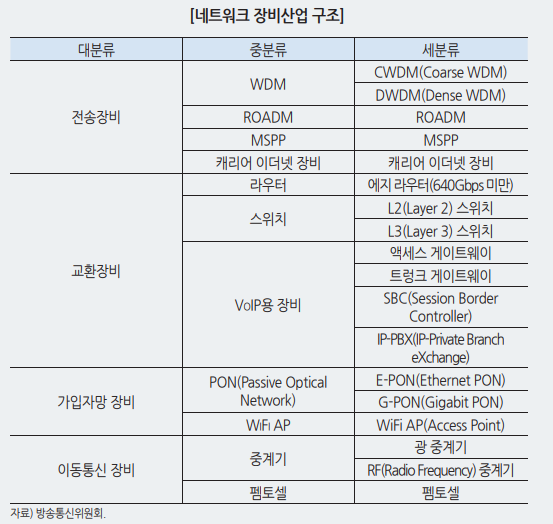

스웨덴 통신장비 제조사인 에릭슨과 LG의 합작법인으로 2005년 설립

에릭슨은 1876년 설립된 스웨덴 최대 그룹

미국 퀄컴사의 이동통신 장비 부분 인수하면서 세계적인 이동통신 기업

세계 최초의 전국망 LTE구축에 기여

한국 최초의 상업용 전자식 전화 교환기 생산, LTE-A 포함한 세계 최초의 전국 망 LTE 구축에 기여

## 경쟁 구도

* 화웨이와 에릭슨이 5G 통신 장비 시장에서 1-2위 경쟁
* 점유율 2.1%p 격차밖에 나지 않음
* 미국 중심으로 반화웨이 정책이 확산되면서 
* 네트워크/ 디지털 서비스 / 관리 서비스/ 이머징 사업 등등
* 네트워크 : 라디오 액세스
* 에릭슨 점유율이 지난 3분기 기준 30.7%
* 미국의 sw와 기술을 이용해 개발된 반도체는 정부 허락 없이 화웨이에 납품할 수 없도록 제재를 가함 -> 점유율 상승
* T-모바일과 수십억 달러 규모의 5G 이동통신망 확대 계약 체결 (노키아와 함께)
* T- 모바일 중대역 네트워크 커버리지 확대에 기여
* 2026년 미국 모바일의 약 80%가 5G 요금제를 사용할 것으로 전망
* 호칸 셀벨 에릭슨엘지 CEO는 "5G에서 다양한 서비스를 효율적으로 관리하고 그 품질을 보장하기 위해서는 엔드 투 엔드(end-to-end) 네트워크가 무엇보다 중요하다"며 "우리는 최상의 5G 기술로 고객에 대한 지원을 지속해 나갈 것

세계 180여 개국에 퍼져 있는 에릭슨의 해외지사 출장 다니면서 !!

 에릭슨LG의 전략은 그동안 연간 1200개 수준의 스마트그리드 구축 프로젝트를 진행해 온 모기업인 에릭슨의 경험이 뒷받침하고 있기 때문에 가능하다.

에릭슨은 전 세계 4200만 개의 스마트미터 플랫폼을 개발해 운영·유지보수하고 있으며, 전 세계 최초로 스마트그리드 통신 네트워크를 위한 LTE 망을 설계·구축한 실적을 보유하고 있다.

20세기 후반부터 이동통신 사업을 주도한 세계적인 통신 기업

**에릭슨, 무선인터넷 접속 제품 제조사 인수… 기업용 5G 시장 공략**
**노키아, 통신장비 칩 회사 사들여… 5G 지원 광통신 기술 확보**
**삼성전자, 5G 망설계·최적화 기업 인수… 다양한 주파수·기지국 대응**
**화웨이, 통신사 대상 컨설팅 서비스… 150개 이상 방법·모델·툴 제공**

* **코어망 산업**은 이동통신 시스템을 구성하는 코어망을 제조하는 산업이다. 
  * `코어망`은 이동통신 단말기의 이동성을 관리하고, 구체적인 서비스를 제공하는 장비이다.
  * SA 방식의 5G 시스템은 코어망에 대한 투자 비율이 높음 >  통신장비 회사에게 기회.
* 이동통신 시스템은 주기적으로 개정되는 통신 표준에 따라 신속하게 제품을 개발되어야 함
* `성능`과 `안정성`을 종합하여 제품 공급 여부를 결정하기에, 해당 업체의 기술력이 필수적

* 이동통신 시스템은 사용자가 네트워크에 연결될 수 있도록 사용자와 무선으로 직접 접속되는 무선 접속망(RAN, Radio Access Network)

* 무선 접속망을 경유하여 사용자에게 서비스를 제공하고 사용자를 관리하는 `코어망`(CN, Core Network)으로 구분할 수 있다

* NSA / SA

  > * NSA 방식(초기 상용망)
  >
  > 단말의 이동성(mobility) 관리 등을 담당하는 `제어 플레인(control plane)`의 동작은 **4G LTE 망을 활용**하면서 `사용자 플레인(User plane/Data plane)`에 해당하는 데이터 트래픽은 5G 네트워크로 주고 받는 방식
  >
  > *  SA 구조
  >
  > 제어 플레인이나 데이터 플레인 모두 `5G의 자체 구조`를 사용하는 구조
  >
  > 두 가지 구조 모두에서 단말은 4G, 5G 두 무선 접속을 동시에 지원하는 형태로 진화하게 된다. 

## 산업 분석

데이터 트래픽 증가에 따라 통신 네트워크 장비 수요 성장세 지속 

* **전송 장비** : 데이터 트래픽을 전기적/광학적 방식으로 송수신할 수 있는 장비
  * 하나의 회선을 분할하여 개별적으로 독립된 복수의 신호들을 동시에 송수신하는 다중화 기술이 중요하다
  * `WDM`
  * `ROADM`(Reconfigurable Optical Add-Drop Multiplexing, 재설정식 광분기·결 합 다중화 장비) : 특정 파장의 광신호를 원격에서 자유롭게 추출 및 삽입할 수 있게 하는 장비
  * `MSPP(Multi Service Provisional Platform, 다중 서비스 지원 플랫폼 장비)` : 하나의 장비에서 ATM 신호, 이더넷 등 다양한 신호 형태의 데이터를 전송 처리
    * `CA`[캐리어이더넷(Carrier Ethernet) ] : LAN 에서 사용되는 스위치의 빠른 데이터 처리 기능이 캐리어 사업자의 백본망에서도 사용되도록 확장성, 안정성을 보강한 스위칭 전송 장비
* **중계기** : 전파가 도달하지 않는 음영 지역이나 기지국의 전파가 약할 경우, 전파를 증폭시키는 장비로서, **RF 송수신 및 증폭**이 주된 기능.
  * 미약한 무선신호를 노이즈 없는 신호로 증폭하여 재전송하는 장비
  * 기지국과 가입자 디바이스의 통신품질 개선 및 음영지역 해소를 위해 사용
  * **광중계기** : 기지국의 RF신호 (전파신호)를 광 신호로 변환하여 광케이블을 통해 원하는 음영 지역으로 전송
* **기지국**(RU - Radio Unit) : 디바이스의 **무선 신호를 송수신**하는 장비
  * 기지국은 이동통신의 세대변화에 따라 무선신호 송수신부(RU), 데이터 처리부(DU)로 분리 운용
* DU(Digital Unit) : 수신한 무선신호를 유선통신이 가능한 데이터로 변환, 역변환
  * 전화국에 위치
* 스몰셀 기지국 : 수십에서 수백미터의 커버리지를 지원하는 소형 기지국
  * 기존 기지국 보완, 음영지역 해소
* EPC(Evolved Packet Core) : 연결관리, 사용자 정보 확인, 과금 등 접속 지원을 수행

* **네트워크 슬라이싱**이란, 하나의 물리적 네트워크를 다양한 서비스 요구 사항을 만족하는 다수의 논리적 네트워크로 분리하는 개념
  * 기존에는 각 서비스를 지원하는 하나의 물리적 네트워크를 따로 구축해야 했다면, 5G에서는 하나의 물리적 네트워크가 여러 종류의 서비스를 수용할 수 있도록 네트워크를 가상화하고 각 서비스에 최적화된 망으로 나눠, 다른 독립된 망 처럼 작동할 수 있도록 해준다.
  * 하나의 물리적인 망 위에 여러 개의 논리적인 망을 만들어 비용을 절감해 주는 것으로 통신사에서는 과도한 투자를 하지 않고도, 5G구현이 가능할 것으로 예상된다.

* 제조사 별 점유율은 화웨이, 에릭슨, 노키아, ZTE, 삼성전자 순
  * 삼성, 화웨이는 스마트폰 및 통신 반도체 기술을 보유하고 있음....
  * 에릭슨은 다양한 포트폴리오 및 레퍼런스 확보 / 통신 사업자들의 선호도 높음 /높은 기술력

* 화웨이는 백도어 이슈를 바탕으로 반화웨이 동맹 형성
  * 백도어 : 인증되지 않은 사용자에 의해 네트워크 기증이 무단 사용될 수 있도록 몰래 설치된 통신 연결 기능으로, 중요 정보 유출 가능성 있음
  * 