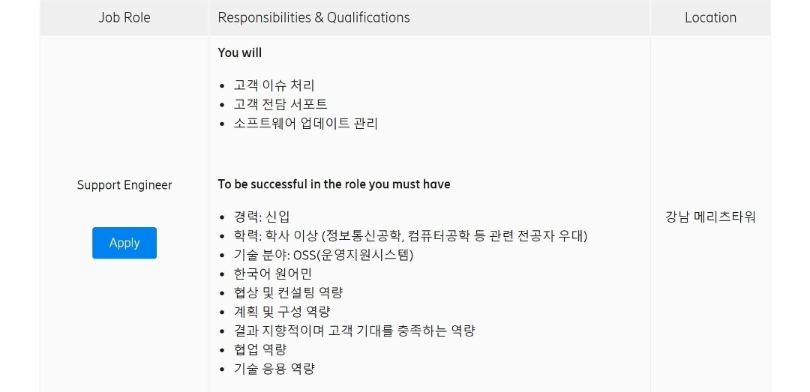
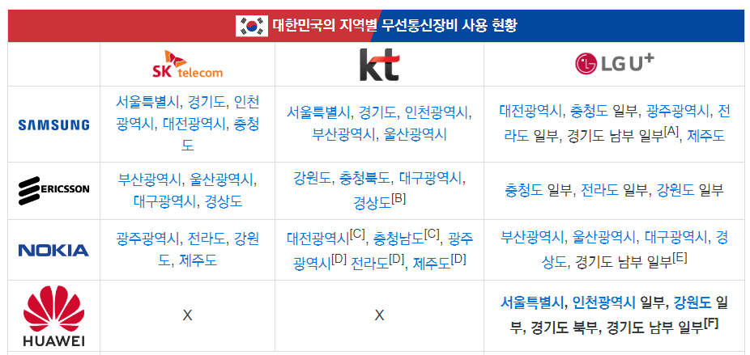

# 자기소개

**안녕하십니까. 에릭슨 엘지 서포트 엔지니어 지원자 윤소윤입니다.**

**예비 엔지니어로서 준비해온 강점 두 가지를 말씀드리겠습니다.**

**첫째, 네트워크 및 IT Skill set을 갖췄습니다.**

**정보통신공학을 전공하면서 정보처리, 무선설비기사를 취득하고, 삼성에서 7개월간 빅데이터를 활용한 IoT 시스템 개발 교육을 이수하면서 통신 장비의 성능을 향상시킬 수 있는 SW 역량을 습득했습니다. 나아가 KT의 기술 지원부에서 인턴십을 수행하면서 고객에게 안정적인 통신망을 지원하는 서포트 엔지니어에 관심이 생겼습니다.** 

**둘째,  유연한 조직 융화력입니다.**

**고객 응대, 네트워크 운용, IT 개발 등 총 5번의 인턴십을 통해 회사마다 고유의 업무 수행 방식을 습득함으로써 소통의 중요성을 깨닫고 조직 적응력을 향상시켰습니다.**

**이러한 경험은 고객 접점에서 발생하는 이슈들을 슬기롭게 해결하는 시너지를 발휘할 수 있을 것입니다. ** 

**서포트 엔지니어로서 4차산업혁명의 핵심 인프라인 5G 네트워크 장비를 지원하고, 대내외 고객과 회사 모두가 윈윈할 수 있는 안정적인 무선 통신망을 제공함으로써 에릭슨엘지가 이동통신 산업의 게임 체인저가 될 수 있도록 기여하겠습니다.**

## 영어 자기소개

**Hi, my name is soyoun yoon.**

**Before start, Thank you so much for giving me the opportunity to this interview.**

**I'm a prospective Support Engineer who can bring passion to Erricson-LG**

**I majored in Information and Communication Engineering in my college.**

**And i've got 2 kinds of certificates in  Engineer Information Processing and Radio Telecommunication Equipment.**

**They've given me opportunity to work at KT for 9 weeks as a Network Engineer.**

**During my intership, I Performed a project about safety supporting solution using wifi-sensing with my coworkers.** 

**It was stimulating as I learned overall IP access Equipments and how to service to end users.**

**when it comes to my selling points for this job, I'm really challenging and i have the ability to adapt to work through job experience in various companies.**

**With the experiences that I’ve mentioned so far, I will bring positive results to Erricson-LG to secure the No.1 market share and meet the satisfaction of all the customers.**

**I’m confident that My work experiences and qualifications would be valuable assets as a support Engineer**

**I'm looking forward to working for 에릭슨엘지**

Thank you...

---

###  마지막으로 할 말⭐

**지금까지 면접을 진행해 주셔서 진심으로 감사드립니다. **

**면접을 준비하면서 인턴십 ,프로젝트 등 다양한 활동들을 되돌아보면서 스스로를 분석해볼 수 있었고 서포트 엔지니어라는 직무를 잘 할 수 있을 거라는 확신이 들었습니다.**

**또한, 신입사원이기 때문에 입사해서 누구보다 더 열심히 그리고 능동적으로 배워야  될 것들이 많다는 것을 저 또한 잘 알고 있습니다.**

**입사 후에 항상 고객 응대를 우선순위로 하는 서포트 엔지니어로서 자아실현과 조직의 목표 달성을 위해 팀원들과 협업하며 상생을 실현해 나가겠습니다.**

**나아가 많은 사람들이 5G 기술을 즐길 수 있도록 안정적인 무선망을 제공하면서 넓게는 글로벌 산업 발전에까지 기여하는 서포트 엔지니어가 되고 싶습니다.**

**지금까지 제 이야기를 들어주셔서 진심으로 감사드립니다.** 

---

### ⭐ 가치관 / 생활 신조

**새로운 관계와 상황에 도전하는 것을 즐기며 배움의 장으로 만들자는 가치관을 가지고 있습니다.**

학부 생활을 하면서 학생회, 대외활동, 공모전, 다양한 인턴 활동을 하면서 성공도, 실패도 많이 겪었습니다. 하지만 실패를 하더라도 이는 도전을 했기 때문에 실패도 있던거라고 마음을 다잡았고, 그를 통해서 좀 더 정신적으로 성장을 할 수가 있었습니다. 

따라서 저는 신입 사원으로서 에릭슨 엘지를 배움의 장으로 선택하여 `회사 생활`과 `고객 대응`에서 발생하는 모든 이슈에 도전하고 능동적으로 대응하는 서포트 엔지니어가 되겠습니다. 

---

* :star:**상사가 부당한 것을 시킨다면?**  = **상사의 부정을 알게 된다면?**

  * 왜 부당하다고 느끼는지 먼저 고민을 해볼 것 같습니다. 

    그 일이 비효율적이고 비합리적인 일이라고 느껴진다면, 조직이기도 하고 신입 사원으로서 어떤 이유에서 인지, 그리고 옳고 그른지 객관적으로 판단할 수 있는 능력이 부족하기 때문에 섣불리 판단할 수 없다고 생각합니다. 그래서 상사의 생각을 따라 업무를 진행하겠습니다. 논리적으로 잘못된 부분이 있으면 일목요연하게 대안을 제시하고 의견을 나누면서 개선해 나가는 방법을 모색하겠다.

    하지만 비윤리적이고 회사에 막대한 손해를 끼친다면 상사님과 회사에 더 안 좋은 결과를 끌어낼 수 도 있습니다. 그래서 관련 규정을 먼저 확인해 본 뒤, 상사님께서 그러한 결과가 나올 것을 아시는지, 대책이 있어서 그렇게 행동하시는 것이라면 팀의 일원으로서 적극적으로 문제 해결을 위해 나설 것이고, 그렇지 않다면 상사님과 의견을 좁힐 수 있도록 설득해보겠습니다. 

    이러한 업무를 함으로써 어떠한 것을 습득하고 배우기를 원하시는 건지 여쭤볼 것 같습니다. 비윤리적이고 합당해 보이지 않는다면 - 혜안을 구해보도록 하겠습니다. 

* **내가 소속된 직무조직의 직속상사(팀장이나, 파트장, 매니저등)가 맘에 안들 때 어떻게 대처해서 조직 생활을 할 것인가?**

  * 상사님이 제 맘에 들지 않더라도 저는 조직의 일원이고.... 상사의 생각에 따라서 맞춰 진행하면서 논리적으로 잘못된 부분이 있으면 대안을 제시하겠습니다 .이렇게 상호 의견을 나누면서 개선해 나가는 방법 모색해 나가겠다.

---

* :star: **고객 요구 사항/ 에릭슨 요구 사항 다를 때**

  > 지연될 수 밖에 없는 상황에 대해 설득하여 기술적, 영업적 신뢰가 저하되지 않도록 서포트  엔지니어가 먼저 역할을 수행 한다.
>
  > 고객사와 대화를 통해서 왜 2달이 거릴 수 밖에 없는 지 설득할 것 같습니다. 물론 고객의 요구 사항을 맞춰주는 것이 중요하지만, 네트워크에서는 안정성이 가장 중요해서, 만약 1달이라는 기간에만 집중해서 업무를 진행하다가는 장비의 품질에 문제가 생길 수가 있어서 장기적으로는 회사에 큰 손실이 생길 것입니다.  해당 이슈에 대한 정확한 일정 검토 및 지연이 된 변수가 어떤게 있는 지 파악한 뒤, 고객과 협의를 해서 지연을 최소화할 수 있도록 진행할 듯.
>
  > 네트워크 장애가 나지 않고 질적으로 우수한 결과물을 낼 수 있도록  최소한의 기한이 2달이라는 것을 고객사에 설득시켜 업무에 영향을 최소화할 수 있도록 진행하겠습니다.

* **이 직무의 앞날이 어떻다고 생각하는지?**

  5G 장비 회사에서 서포트 엔지니어는 가장 중요하고 발전 가능성이 무궁무진하다고 생각합니다. 

  세계적으로 5G 투자가 확대 되고 있고, 에릭슨 지속 가능성을 목표로 5G에 전폭적인 투자를 하면서 조직을 키워 나가고 있습니다. 이는 고객 접점에서 일하는 서포트 엔지니어로서도 전문성이 강화된 다는 것입니다.  연구소에서 아무리 혁신적인 장비를 만들고, sales팀에서 아무리 영업을 잘 해도 고객접점에서 일하는 서포트 엔지니어가 전문성과 책임감을 가지고 일 하지 않는다면 결국 고개 만족과 신뢰도가 떨어질 것이라 생각합니다. 

  **서포트 엔지니어는 고객을 대하기 때문에 막중한 책임 의식과 회사에 대한 주인의식을 가지고 일해야 하는 업무....**

  *에릭슨 - 무선 인터넷 접속 제품사를 인수*

* **왜 Support Engineer?**

  * 연구를 통해서 아무리 좋은 장비가 출시되고, 실력이 좋은 Sales팀이 영업을 잘 해도 고객 접점에 있는 서포트 엔지니어가 책임감을 가지지 않고 업무를 수행한다면 상호 신뢰도가 떨어질 것이고 고객 만족도도 떨어집니다. 그렇기 때문에 저는 가장 중요한 업무 중에 하나라고 서포트 엔지니어라고 생각합니다.
  * No matter how well the R&D develop the best equipment and how well the sales team sell the solution, if the support engineer handling the customer issues performs without responsibility, mutual trust and customer satisfaction will decrease. Therefore, I think it is one of the most important duties, as a support engineer.

* **인턴 경험이 SE 수행에 도움이 될까?** /  **인턴 경험을 통해서 얻은 게 무엇? 소통/ 갈등 해결 ??**

  * 인턴십은 단순히 직무 체험 뿐만이 아니라 `전화 받기, 이메일 작성, 보고서 작성` 등 비즈니스 매너를 습득하고, 조직이 공동의 목표를 수립하기 위해 어떠한 노력을 해야 하는지도 배운 경험입니다. 또한 제 직무에 대해서 끊임없이 고민을 해왔는데, 다양한 업무를 수행하면서 산업과 직무에 대한 방향성을 찾을 수 있었습니다. 

    Internships are not only job experiences, but also business manners such as 'receiving calls, writing e-mails, and writing reports' also I can learn how I can acheive the common goals for compamy. and after that, I have been constantly thinking about my job, and I was able to find the direction of the industry and job while doing various tasks.

    단순히 운용 업무보다는 업데이트나 개발 관련된 업무를 하면서 산업 발전에 도움이 되는 업무를 하고 싶었는데, 또 그렇다고 IT 개발 직무는 개인주의 성향이 굉장히 강하기 때문에 소통하면서 업무를 능동적으로 할 수 있는 직무가 무엇일까 고민하다 찾은 게 기술 지원 업무를 수행하는 `서포트 엔지니어`였습니다.  

* **최근 이슈 기사 요약**

  * `코로나 백신`

  * `넷플릭스 법`: 과도한 트래픽을 유발하는 CP 사업자에게 망 품질 유지 비용을 청구하는 것

  * `5G 특화망` :  기존에는 기업이 공장 건물에서 5G 이용하려면 통신 3사의 5G 망을 빌렸어야 했는데, 5G 특화망이 통과가 되면서 앞으로는 기업이 직접 주파수를 할당 받아서 기지국을 구축해 산업에 활용할 수 있습니다.

    한전이나 일부 기업들이 이제 자체적으로 구축하는 시스템에 관심이 많은 데 그로 인해서 장비 업체의 수주 기회 또한 늘어나는 것이기 때문에 통신장비 회사에게는 아주 긍정적인 영향을 미치지 않을까 하는 생각이 듭니다.

  * `private 5G `: 지역 도입 서비스에 특화된 맞춤형 NW

* **리더로서의 역할 : 리더와 팔로워간 협업!!** 

  * 리더로서 얻은 것과 필요했던 것이 뭔지 알 수 있었다. 리더십을 잘 발휘하기 위해서는 팔로워의 위치에서 좋은 리더는 어떤 사람인지 계속 생각해 볼 필요가 있다.
  * 팀의 목표가 무엇인지 정확하게 안다.
  * 팀원들이 의견을 낼 수 있도록 도와 준다.
  * 구성원의 역량과 이전의 역할들을 파악해서 업무를 분장하는 리더가 좋은 리더라고 생각합니다. 
  * 캔 통신을 이용한 IoT 차량의 부품 관리 및 주행 보조 시스템 개발 경험.

* **팀원으로서의 역할**

  * 시키는 대로만 하는 것이 아니라, 리더가 보지 못하는 부분을 파악하고, 리더에게 긍정적인 리액션을 잘 해주는 팀원

    (리더의 그늘에 가려져서는 안된다.)

  * 인턴 생활을 하면서 업무가 원활히 진행될 수 있도록 보조도 하고, 프로젝트의 빈틈을 채워가는 팔로워로서 역량도 향상해 나갈 수 있었다 

    입사 해서 팀원으로서 선배님들에게 능동적으로 배우고 노하우를 전수받으면서 성장해 나가겠다.

    그 이후 면접관 님들처럼 리더의 자리에 올랐을 때 좋은 후배를 양성하고 에릭슨 엘지의 지속 가능한 성장을 향해 나아갈 수 있을 것 같다.  

* **가장 좋아했던 전공 과목?**

  디지털 통신 시스템, 신호 처리 등의 과목이었습니다. 다른 교수님들과 다르게 학생들과 소통하면서 수업을 진행하시기도 했고, 제 지도 교수님이셔서 진로 상담이나 이것 저것 해보다 보니 잘 보이고 싶은 마음에 굉장히 열심히 공부를 했습니다. 그러다 보니 결과까지 A, A+ 이상의 좋은 성적을 얻을 수 있었어서 가장 좋아하고 즐거웠던 과목이었습니다.

* **본인의 역량으로 회사에서 무슨 일을 할 수 있나요?**

  대내외 고객과 상호 신뢰를 쌓아 가는 서포트 엔지니어가 되겠습니다.

* **지금까지 배운 통신 기술을 설명해 주세요**

* **RFP/ 제안서**

* `RFP` : 발주자가 자사의 시스템 구축을 위해 요구 사항을 정리해서 제안을 요청하는 것
  * `제안서` 는 현안 해결 방안을 제시해서 수주할 수 있도록 제안하는 것
  * 기획자와 개발자 입장이 직접 되어보면서 서비스 기획 > 현업 엔지니어 분들에게 저희가 작성한 것을 토대로 발표를 진행하면 전략과 서비스를 평가 해주심


* **궁금한 거?**

  * 입사하게 되면 같이 일하게 될 팀 규모를 알 수 있을까요?

  * what are the career development opportunities at this company?

    (커리어 트레이닝을 제공한다면 어떤 것들이 있을 까요?)


### 전공 선택 이유

킨텍스 한국 전자전KES (Korea Electronics Show)에 갔는데, 상상을 실현시키는 전자공학에 대해 보고 연구 개발에 대한 큰 꿈을 가지고 입학를 했다. 입학을 해보니 전자공학에는 통신, 반도체, 제어 등의 많은 분야가 있었고, 연구 개발 뿐만이 아니라 엔지니어, 품질 등의 직무로도 산업의 발전에 크게 기여할 수 있다는 것을 알게 되었다. 그 중에서도 통신으로 선택한 건 4학년 때 2018년도였는데, 4차산업 혁명과 5G 상용화 등이 떠오르던 시기여서 가장 성장 가능성이 높아 보여서 선택하게 되었다.

### 5G

초고속, 초저지연, 초연결성이 있습니다.

**초고속**은 데이터 전송속도가 최대 20Gbps로, LTE의 20배 가량 되는 속도를 낼 수 있습니다.

**초저지연성**은 무선 지연이 1ms로 lte의 1/10수준의 빠른 응답을 보여 줍니다.

**초연결성**은 동시 접속이 가능한 기기의 수가 1km반경 내에 100만대나 된다는 것입니다.

이러한 특징을 기반으로 이전의 이동통신과 다른 점은 다양한 산업과 연관된다는 것입니다. 

* 초저지연성과 초고속성의 차이점은?
  - **초저지연성** : 스마트폰과 같은 단말기에서 전송한 데이터가 기지국과 서버를 거쳐 다시 단말기로 되돌아 오는 데 걸리는 시간이 획기적으로 줄어드는 것
  - **초고속성** : 넓은 주파수 대역을 사용해 많은 양의 데이터를 한 번에 전송할 수 있는 **초광대역**.

# 로열티

* CEO 이름 : **뵈르예 에크홀롬**

* 비전 : **Ericsson’s sustainability efforts**
  
* Sustainability remains among Ericsson’s chief priorities for 2021
  
* 에릭슨-LG 어떤 회사?

  에릭슨과 엘지전자가 합작해서 만든 회사로 가트너가 5G 인프라 리더로 선정했을 만큼 전세계에서 뚜렷한 입지를 나타내고 있다.

   한국 통신의 역사를 40년 이상 이끌어 왔습니다. 
  
  It's a joint venture between Ericsson and LG Electronics. Gartner has selected Ericsson as the leader of 5G infrastructure. It is a company that has led the history of Korean telecommunications for more than 40 years by contributing to Deokyul wind and electronic exchange. I want to grow into a support engineer by learning Ericsson's technical know-how and portfolio.

* **에릭슨-LG 인재상**

  아마 통신 장비 회사인 만큼 새로운 것에 도전적이면서도 네트워크 리스트가 발생하면 안되기 때문에 품질 측면에서는 섬세하고 안정성을 추구하는 인재를 선호할 것 같다. 

* **회사 지원 동기**

  * 에릭슨의 지속적인 성장 가능성과 조직 문화를 보고 지원했습니다.

    4차산업혁명이 플랫폼화가 되기 위해서는 방대한 데이터를 신속하게 처리하기 위한 5G 통신 장비의 역할이 가장 중요하다고 생각합니다. 그 중에서도 세계 최대의 통신 회사인 Ericsson은 회사 내에서 체계적으로 구축된 시스템 환경 아래 어느 업무나 포지션이든 개인의 역량 발휘와 목표 실현할 수 있도록 도와주고 있습니다. 또한, 다양성을 포용하는 가족 친화 경영 철학, 여성 인재들이 ICT 산업에 진출할 수 있도록 girls in ict를 개최하는 등 기회를 주고 있는 기업입니다. 이러한 에릭슨 엘지의 서포트 엔지니어로서 많은 사람들이 5g의 기술을 즐길 수 있도록 안정적인 무선 망을 지원하고, 넓게는 글로벌 산업 발전에까지 기여하며 저의 역량과 꿈을 실현해 나가고자 지원했습니다.

  * I'm applying for EricssonLG because of their sustainability efforts and organizational culture.
    In order for the fourth industrial revolution to be platformed, I think the role of 5G equipments to quickly process a lot s of data is the most important. Among them, Ericsson, the world's largest telecommunications company, is helping individuals achieve their capabilities and goals in any job or position under a system environment within the company. 

    In addition, erricson is giving opportunities to woman such as holding girls in ICT every year in order for female talent to enter the ICT industry. 

    As a support engineer for Ericsson LG, I'll contribute to customer's and ourt inovation by supporting a stable wireless network so that many people could enjoy 5G

    In the future, I'm looking forward to contributing to the development of the global industry.

* **본인의 장점**

  * 제 장점은 조직 적응력과 사교성이 좋다 입니다.

    아르바이트나 대외 활동 학생회 등 사회생활을 하면서 남녀노소 다양한 사람을 만날 수 있었고, 먼저 다가가는 법을 배운 것 같습니다.  

    한국철도공사, 네이버, 티맥스 소프트 등 다양한 곳의 인턴에 도전을 해왔습니다. 회사마다 고유의 업무 방식이나 다양한 브랜드들을 체험해볼 수 있었고 이는 책임감과 스스로의 적응력을 높이는데 큰 도움이 되었습니다. 

    이러한 저의 장점은 고객 만족을 높이고 유관 부서 및 동료들과 소통하여 안정적인 통신 솔루션을 제공하는 데 큰 도움이 될 것이라고 생각합니다. 

  * 직무 장점 ) 

    정보 통신 공학을 세부 전공으로 선택하고 통신 지식을 쌓고자 정보 처리 기사, 무선설비기사를 취득하고, IT인프라 기업인 네이버 데이터 센터와 KT에 근무하면서 실무를 체험해보면서 이러한 통신 산업에 관심을 가지게 되었습니다. 

* **단점**

  * 단점은 행동하기에 앞서 다른 사람의 감정에 민감하게 반응하는 것입니다. 모든 사람에게 일일이 맞춤형 인간이 되고자 하며, 관계에 있어서 제 스스로 힘들어지는 경우가 있습니다. 이에 영향을 받지 않기 위해 다른 사람의 관점에 있어서 저를 독립적으로, 긍정적으로 보려고 노력합니다.

  * 결정을 내릴 때 고민이 많다는 게 저의 단점입니다. 
    사소하게는 배달 음식 고민부터 크게는 프로젝트 진행할 때 일어날 수 있는 모든 케이스들을 생각하다 보니까 진행이 지체될 때가 있었습니다. 부수적인 것을 처음부터 생각해서 판단력이 흐려지는 문제를 방지하고자 스탑워치를 이용해서 판단력을 높였고 그 외적인거는 나중에 추가시키면서 시간 관리를 효율적으로 하고자 노력했습니다.

  * 하나를 오랫동안 생각하고 있다 보면 그게 옳은지 그른지 판단하는 능력이 떨어지기 때문에 시간을 효율적으로 배분하는 게 중요합니다.

  * 어렸을 때 다소 소극적이고 남들 앞에 섰을 때 얼굴이 빨개지는 성격을 갖고 있었습니다.

    그래서 수동적인 학교생활이 기억에 남았고, 이러한 성격을 고쳐 보고자 대학에 입학과 동시에 1000여명의 학생들을 관리하는 학과 학생회를 3년 동안 운영했고, 전주 국제 영화제와 같은 대외 활동도 경험했습니다.

* **타인이 본 나의 장/단점**
  * 항상 웃는 상으로 사교성이 좋다는 소리를 많이 들어왔습니다.
  * 우유부단해 보여서 

* **내가 Support Engineer를 잘 할 수 있는 이유(뽑아야 하는 이유)** - 직무 지원 동기

   서포트 엔지니어는 어느 정도의 HW,  SW 및 네트워크 지식을 갖추고 다양한 고객들을 상대할 수 있는 응대 능력 Skill -Set을 갖춘 엔지니어가 필요할 것이라고 생각했습니다. 정보통신공학을 세부 전공으로 선택하면서 HW와 네트워크 역량을 쌓고자 기사 자격증을 취득했고, 7개월간 삼성 교육센터에서 프로그래밍 역량을 향상시켰습니다. 또한 수년간 인턴과 아르바이트 경험으로 쌓아온 고객 응대 경험까지 저의 역량과 경험이 서포트 엔지니어 직무에서 필요로 하는 부분과 매칭 된다고 생각해서 지원을 했습니다.  

* **5G는 S사가 더 잘나가는데 굳이 에릭슨?**

  * 작게 봤을 때는 국내에서는 삼성의 입지가 워낙 크기 때문에 그렇게 생각할 수도 있지만, 넓게 봤을 때는 에릭슨이 통신 장비로서 세계 1위 입니다. 저는 140년 에릭슨의 기술 역사와 에릭슨 엘지가 덕률풍과 전자교환기에서 시작해서 한국 통신의 역사를 함께 해온 기업이기 때문에 그러한 노하우와 기술력을 배울 수 있는 에릭슨을 선택했습니다.

* **미래 통신 업계 어떤 방향으로 나아갈 것 같은가?**
  
  * 기존에는 이동통신에만 한정되어 있었다면,  5G의 특성에 맞게 AI, IoT, 자율 주행 등 다양하게 뻗어나갈 것 같습니다. 
  * IoT : IoT 기반의 스마트팩토리(중국, 난징) / ABC

* **외국계 회사 지원 이유?**

  1. 우수한 조직 문화

  세계 최대의 통신 회사인 Ericsson의 회사 내에서 체계적으로 구축된 시스템 환경 아래 어느 업무나 포지션이든 개인의 역량 발휘와 목표 실현할 수 있도록 도와주는 Ericsson-LG에서 저의 역량과 꿈을 실현할 기회를 얻고자 지원하였습니다. 이러한 기회를 통해 대한민국을 넘어서 전세계의 통신 장비 점유율을 확보하고 통신 산업의 발전에 기여하고 싶습니다.

  2. 스웨덴 폴란드 중국 등 출장을 통해 글로벌 엔지니어들과 일할 기회 / 글로벌 기업의 프로세스 경험

  3. 개개인의 능력치 발전에 관심이 많다
     * 업무와 연관성 있는 교육이 많다
     * 신입들도 의견을 낼 수 있는 구조

* **회사의 특수성 적응 가능?**

  비록 두 달이었지만, 필리핀에서 인턴 생활하면서 외국인들과 문화적인 다양성에 대해 이해할 수 있었고, 적응 측면에서는 영어 공부만 계속 꾸준히 한다면 전혀 문제될 것이 없을 것이라고 생각 합니다. 회사에서도 직무 관련이나 영어 교육으로 직원들의 역량 향상에 노력하고 있다고 알고 있습니다.  

* **어떤 걸 준비해왔나?**

  정보통신공학을 세부 전공으로 선택하면서 통신 전공과목들을 이수 했고,  학부생으로서 부족하다고 생각했던 네트워크와 무선통신에 대한 지식에 깊이를 더하기 위해 **정보처리기사와 무선설비기사**를 취득했습니다. 또한 요즘 **클라우드 기반의 기술들이 많이 적용**되고 있기 때문에 `IoT 시스템 개발 교육을 이수하면서 프로그램 로직 역량을 향상`시켰습니다. 마지막으로 IT 인프라 회사인 KT와 데이터 센터에서 엔지니어 인턴으로서 소규모 프로젝트를 진행보면서 프로젝트 기획 및 개발까지 향상 시킬 수 있었습니다. 

* **입사 후, 회사에서 구체적으로 어떤 일 하고 싶은가?**

  **단기적/ 장기적 목표**

  * **신입 사원으로서 능동적으로 업무 파악 / 장기적으로는 솔루션 및 프로젝트 관리까지 할 수 있는 서포트 엔지니어로 성장하겠다.**
  * Ericsson-LG의 기지국, 코어 등 통신 장비 솔루션에 대해 이해하고  **ISP 사업자의 시스템 설치 상황 및 기술 지원 업무 체계 등을 모니터링하여 빠른 시간 내에 전반적인 이해도**를 높이겠습니다. 
  * 5년 ~10년 이내에`PMP 자격증`을 습득하고 활용하여 `고객 만족도를 높이는 프로젝트 솔루션 관리`를 함으로서  모두가 Win-Win할 수 있는 통신 솔루션을 제공하는**Support Engineer로 성장**하겠습니다. 

*  ***PMP*®(Project Management Professional) 자격증**

  SI/ IT 업체에서 많이 취득하는 자격증인데, 프로젝트 관리, 소통, 갈등, 협력 등에 관한 내용을 담고 있어서, 그런 공부를 한다면 고객 대응을 하는데도 원활하게 도움이 되고 회사의 경쟁력 향상에 도움이 될 것이라고 생각했습니다.

* **왜 통신 전공?**

  전자공학을 전공하면서 반도체, 제어 등 다양한 전공을 배우는데 각각 매력이 있었습니다. 

  아무래도 일상 속에서 핸드폰, 와이파이 와 같은 기술들 때문에 통신에 대한 접근성이 쉬운 것도 있었고,  4학년 때 세부 전공을 선택하는데 그때 막 프로그래밍, 4차 산업혁명, 5G상용화 이런 것들이 가장 큰 이슈였어서, 정보통신이 가장 성장 가능성이 높다고 판단을 해서 선택했습니다. 

* :star2:  ​**회사 선택 기준은?** / 직업관

  * 직업을 선택할 때 가장 중요한 요소는 **지속 가능성을 목표로 도전하는 회사에서의 자아실현**입니다.

    회사가 지속 가능하게 발전하고 성장한다는 의미는 조직이 커지면서 동시에 제 스스로의 전문성도 강화될 수 있는 기회라고 생각합니다. 

    제가 입사하게 된다면 하루 중에, 9 - 6 일하면 최소 9시간을 , 그리고 일주일 중에 가장 많은 시간을 할애해야 할 곳은 결국 직장입니다. 일을 통해서 자아를 실현하는 것은 당연하고, 저의 기여로 인해 회사가 성장하고 동료와 상사님들께 인정을 받아 저의 존재감을 확인한다면 제 스스로에게 의미가 있을 것 같습니다. 

    제가 가진 모든 역량을 발휘해서 에릭슨 엘지와 함께 지속 가능한 성장을 이뤄내고 싶습니다.

  ```markdown
  * 2021년 에릭슨의 CEO님도 코로나 상황에 맞춰서 지속적인 성장 가능성을 올 해 목표로 둔다는 연설을 보았습니다. 
  
  * 세계적으로 5G에 전폭적인 투자를 하고 있고, 에릭슨-엘지는 4차산업혁명이 실현되기 위한 기반 기술인 5G 장비와 솔루션에 압도적인 투자를 하고 있는 기업입니다.
  ```

  * 개인의 역량 발휘와 목표 실현을 도와주는 조직 문화

  * 직무 적합성 : 가장 잘 할 수 있고 자신 있는 업무를 하는 것이 가장 중요하다고 생각합니다.

    제가 맡은 일에 자부심과 만족도가 없다면 직무에 관련한 저의 모든 말에 대한 고객과 동료들의 신뢰도가 떨어질 것이고, 그에 따라 성과 또한 저조할 것이라고 생각이 됩니다. 

  * 기준에 부합하는 다른 회사도 많지 않는가? 우리 회사가 그 기준에 부합한다고 생각하는 이유가 뭔가?

  ```markdown
  한국 통신을 이끌어온 긴 역사와 노하우로 체계적으로 잘 갖추어진 에릭슨 엘지에서 만족감과 자부심을 느끼면서 함께 성장하고 싶음
  ```

* **어떤 자세로 일을 배울 것인지?**

  이동통신사에서 인턴을 경험해보면서 느낀 건 통신의 범위가 워낙 광범위해서  제가 아는 지식은  (빙산의 일각)극히 일부분에 불과했다는 것입니다. 그래서 입사하면 직무 전문성을 키우기 위해 처음부터 배운다는 생각으로 통신 기술 및 장비에 대한 직무 지식을 능동적으로 습득하겠습니다. 나아가 이동통신사라는 고객과의 접점에서 선배님들의 이슈 대응법을 보고 배워 실천할 수 있도록 성장해 나가겠습니다. 


# 인성

* **인생에서 가장 힘들었던 경험**

  네이버의 전환형 인턴에서 좋은 결과를 얻지 못했을 때 입니다. 개인 프로젝트 발표에서 1등을 해서 전환에 대한 기대가 있었는데, 데이터 센터가 아무래도 무인화가 되어 있어서 인원을 감축하는 탓에 티오가 없었습니다. 타 부에서는 타 인턴들이 있었기 때문에 순위가 밀리게 되었습니다. 

  정말 많이 노력을 했기 때문에 제 자신도 정신적으로 힘들었지만, 가장 힘들었던 건 부모님과 저에게 도움을 많이 주었던 사람들에게 미안했고, 이야기 하는 게 힘들었습니다. 그 당시에는 굉장히 힘들었지만, 돌이켜보니 도전이 있었기 때문에 실패도 있었던 거라고 생각하고 마음을 다잡을 수 있었습니다. 

  * **프로젝트 수행 중 힘들었던 경험이 무엇인가요?**

  삼성에서 it 교육들을 때 첫 번째 코딩 프로젝트에서 나 빼고 다 전공자였다. 남에게 피해를 끼치는 거를 굉장히 싫어해서 혼자 3일 내내 밤 새워 가면서 기능 구현하고 뒤쳐지지 않으려고 노력했던 경험이 있다.

  

* **리더쉽 발휘한 경험** : 외국인 팀원을 서포트하는 리더십을 발휘한 경험이 있습니다.

  적응이 힘든건 아닌지 하는 마음에 조심스럽게 물어봤습니다.

  베트남 - 만삭인 아내 - 학업에 몰두하기가 어려워 - 그러한 상황을 이해 하고 팀원들이랑 함께 도와줬다. 과제 자료 작성도 도와주고 진행 상황을 알려줬다.  - 적극적으로 참여를 해주어서 성공적으로 프로젝트를 진행해서 금상까지 수상할 수 있었다.

* **남자 사원들과 어울려 일하는데 안 힘들 것 같은가?**

  전자과를 전공하다 보니까 90%가 남자인 그런 남초과에 있으면서도 학생회 활동을 적극적으로 임했었습니다. 또한 대다수의 인턴활동을 할 때도 어느 회사를 가더라도 90%는 남자 직원들이셨는데 잘 융화될 수 있었습니다.

* **고객이 막무가내로 요구하면 어떻게 대응할 거냐?** 

  * 회사의 기술적 / 영업적 신뢰도가 저하되지 않도록, 저희의 의견을 수용할 수 있도록 설득하겠다.
  * 고객님의 요구를 들어드림으로서 발생하는 이득/ 손해 분석, 해결해야 될 변수를 조사해보는 등 상황을 분석해서 고객을 설득시키겠다.

* **세대 차이 극복 요령?**

  - 생활여건, 교육 방식으로 인해 차이가 있을 것이다. Gap 줄이기 위해..? 상대방의 입장, 역지사지로 행동하는 습관, 공통관심사로 대화를 하려는 습관.

  아무래도 생활 여건, 교육 방식의 차이로 인해 세대 차이가 생기는 것은 당연한 것이라 생각합니다. 저는 그러한 세대 차이를 인정하고 그 차이를 줄이기 위해 상대방의 입장에서 이해하고, 역지사지로 행동하는 습관을 가지려고 노력했습니다. 인턴 근무 당시, 사무실에는 다양한 연령대의 사람들이 있었습니다. 그 중에는 서른살 넘게 차이나는 상사님들과 `공통 관심사를 통해 실제로 유대감을 형성`해 가까워질 수 있었습니다.

* **고민 끝에 문제를 해결한 경험** = > 베트남...

* **지원 직무에서 가장 중요한 점과 필요한 역량?**

  * 고객과 신뢰를 구축하고 응대할 수 있는 업무에 대한 책임감과 협업 역량입니다. 

* **정규 과정을 거친 사람 비교했을 때 나의 장점 / 단점**

  * 장점 : 어린 나이부터 사회생활을 시작해서 다양한 사람들과 어우질 수 있는 적응력을 가진 것 같습니다.
  * 단점 : 단점은 아무래도 또래 친구들이 적었어서...

* **회사 동료가 나를 싫어한다면**

  먼저, 갈등이 생겼을 때는 왜 갈등이 생겼는지 저를 먼저 뒤돌아본 뒤 상황을 파악하겠습니다. 제가 혹시 먼저 잘못한 게 있지 않을까, 원인 분석을 한 뒤 그것을 고치도록 노력했습니다. 

  덮어두기 보다는 상대방을 찾아가 대화를 시도해볼 것 같습니다. 술자리를 마련한다던지 해서 진솔한 대화를 통해서 서로의 입장을 얘기 해보면서 오해를 풀어나가겠습니다. 또한 유대감을 쌓고, 공통 관심사로 대화를 하면서 관계를 극복하고자 노력하겠습니다.


* **규율 어긴 경험**

  커피전문점에서 아르바이트를 하면서 규정을 어길뻔한 경험이 있습니다. 모든 음식 재료들은 선입 선출이 이루어져야 했고 유통기한 확인을 위해 원재료가 담겨있던 봉투를 보관해야 했습니다. 하지만 실수로 원재료 봉투를 버린 그날, 본사 Qa분이 점검을 나오셨고, 저는 유통기한이 지난 봉투가 보관되어있는 것을 확인했습니다. 재료 자체는 유통기한이 남아있는 제품이었지만 증명되는 것은 지난 원재료 포장지였기 때문에 엄청 혼이 났습니다. 그날의 경험 이후로, "한번만 더" 확인하자는 마음으로 모든 업무를 재검토하며 진행했습니다.

* **업무가 본인에게 맞지 않는다면?**

  저에게 그 직무가 맞지 않는다면, 속마음을 털어놓을 수 있는 선배님에게 다가가 저의 상황을 이야기 해볼 것 같습니다. 혹여나 저와 같은 상황을 겪어본 적이 있는지, 만약 비슷한 상황을 겪어본 사람이 있다면 어떻게 해결했는지 먼저 조언을 들어볼 것 같습니다.

  입사 전에 막연히 제가 생각한 일과 입사 후에 실제로 하는 일에 차이가 있을 수는 있을 것이라 생각합니다. 그러한 일을 최대한 방지하고자 제가 인턴을 통해 직무체험을 여러번 한 것이고, 직장인은 프로이기 때문에, 업무가 잘 맞지 않더라도 수행할 수 있도록 노력해야 한다 생각합니다.

  좋아하는 일만 하고 사는 직장인 없기 때문에 그러한 과정도 제가 성장해 나가는 과정이라고 생각하고 극복하기 위해서 노력하겠습니다.

* **본인의 전공 소개**

  전자공학을 전공하면서 반도체, 제어, 의료기기, 통신 등을 배웠습니다. 인간의 삶을 편리하게 해주는 기술을 배워서 프로그래밍과 더불어 현대 문명의 핵심인 전공이라고 생각합니다. 그 중에서도 저는 정보통신공학을 세부전공으로 선택해서  서포트 엔지니어로서 업무를 수행할 수 있는 많은 과목들을 이수했습니다.

  `I majored in electronic engineering and learned semiconductor, mechanical control, medical device, telecommunications. I think it is the core of modern civilization along with programming because Electronic Engineers make human life convenient. Among them, I concentrated on information and communication engineering. and I took many classes which are very useful to work as a Support Engineer In ELG `

  **전공에서 배운 직무 관련 과목?**

  전자공학 - 반도체/ 제어 / 통신 / 제어 등 다양한 것을 배웠고, 그 중에서도 저는 통신을 전공하면서 디지털, 아날로그 , 프로그래밍 등 다양한 것들을 배울 수 있었습니다.

* :star2:**고객 시스템에 문제가 생겨서 저녁에 출동해야 할 수도 있는데 괜찮니?**

  **네. 시간에 얽매이지 않고 서포트 엔지니어로서 당연히 출동해야 한다고 생각합니다. 저희 회사에서 공급한 제품에 문제가 생긴 이슈이고 이에 적절히 대응하지 않으면 고객 만족도와 신뢰도가 떨어질 것입니다. 따라서 저녁이라는 시간에 얽매이지 않고 빠르게 해결해야 할 의무가 있는 직무가 서포트 엔지니어라고 생각합니다.** 

* **검정고시 왜??**

  솔직히 말씀드리면 청소년기에 소위 말하는 노는 친구들과 약간의 트러블이 있었습니다. 검정고시에 대한 시선이 좋지 않아서 많이 고민했지만, 그 당시에는 정신적으로 성숙하지 않았던 탓에 그러한 괴롭힘을 버티기가 힘들어서 자퇴를 결정을 했었습니다. 그리고 제가 한 선택에 후회를 하지 않기 위해 아르바이트와 학원을 다니면서 그런 것들을 다 잊고 알차게 살고자 노력을 하면서 오히려 정규 과정 이상의 경험을 얻었던 것 같습니다.  대학에 입학해서는 친구들과 많은 추억을 쌓고 싶어서 3년 동안 학생회 활동이나 대외 활동, 다양한 인턴 활동들을 하면서 조직원으로서 융화되고 스스로도 정신적으로 성장할 수 있었습니다. 

* **회사에서 이런 거는 정말 싫다.**

  맘에 들지 않더라도 조직이니 순응하는 게 직장인으로서의 프로 의식이라고 생각하지만

  굳이 뽑자면  직원들과 소통이 되지 않는 회사인 것 같습니다. 

* **주변에서 지원자를 어떤 사람이라고 하는지?**

  사회생활에 특화된 사람처럼 보인다.

* **입사 후 회사와 맞지 않는다면?**

  맞추려고 노력한다. 어떠한 부분에서 맞지 않는 지 먼저 파악 (직무, 회사,분위기)

  직무가 맞지 않으면 그 또한 업무의 확장과 함께 성장할 수 있는 기회라고 생각.

   인턴 경험을 통해 느꼈는데 완전히 맞는 회사는 없다. 조직의 일원이기 때문에 제가 맞춰 가야 한다.

  회사를 지원했을 때의 초심을 잃지 않고 배워나가는 트레이닝이라고 생각하고 견딜 것

* **본인의 업무 스타일은?**

  * 꼼꼼함??
  * 의사소통할 때는 경청

* **남이 하기 싫어하는 일 해보셨어요?**

  * 코레일 체험형 인턴 - 노란 선 안으로 들어가 있으면  x
  * 12월이라 엄청 추운 겨울이었는데  - 

* **상사와 의견이 다를 때 어떻게 하시겠어요?**  = **상사와의 트러블 대처법**

  * 업무적인 갈등 : 상사의 의견 따른다 / 경험이 많고 노하우

    다른 의견이 있을 대 의견을 더 할 필요가 있을 때는 의견 개진해서 

  * 비업무적인 갈등 : 최적의 솔루션 도출을 위해 상사와 커뮤니케이션

* **10년 후 본인의 모습?**

  통신 장비와 고객 응대 노하우가 쌓인 서포트 엔지니어로서 성장해있지 않을 까..

  PMP 자격증

  통신 세대 교체

* **단체 활동 시 어려운 점**

  단체 활동은 사람이 많다 보니 단합이나 의견 취합이 어려운 점

  3년 동안 1,000여 명의 학생을 관리하면서 개강/종강 모임, 체육대회 등 모든 학과 행사를 운영했습니다. 하지만 학생 수가 많다 보니 단합이 되지 않았고, 체육대회 또한 참여율과 여론이 좋지 않았습니다.
  3학년 때는 이제 문제를 해결하고자 재학생 및 학생회와 소통하며 기존 시스템과 다르게 과사랑 협의를 해서 장학금과 연계되는 전공 포인트를 참여 종목, 날짜에 따라 세부적으로 차등적으로 지급하며 학생들의 참여율을 높이고자 노력했습니다. 익명의 설문지로 간식 사업에 대한 의견을 받고, 과티 디자인 공모전을 열어 상금을 지급해 주는 등 과감한 도전을 했습니다. 

  그 결과, 30%도 참여하지 않던 기존과 다르게 역대 최고의 참여율로 체육대회 전체 3등이라는 성적을 얻었습니다. 조직에 대한 주인 의식이 있었기 때문에 새로운 변화를 주도할 수 있었고, 고객과 학생 모두가 만족해하 행복한 대학 생활을 만들기 위해 최선을 다했던 경험이었습니다.

* **가장 기억에 남는 프로젝트(Best Practice)** = **가장 힘들었던 프로젝트**

  IoT 프로젝트 - 혼자 전자공학과라서 아두이노나 HW 측면에서 지식이 있어서 자발적으로 리더를 맡았습니다. 

  시연 실패 > UCC 처럼 영상 촬영해서 보여줌

* :star:**본인에게 워라밸의 의미?**
  
  * **워라밸도 워크가 중심이 잘 섰을 때 자연스럽게 라이프와 밸런스가 맞춰지는 것이라고 생각합니다.**
  
  * 하루 중 가장 많은 시간을 보내고 어쩌면 평생 해야 하는 일에서 자아를 실현하는 것은 당연하다고 생각한다.  입사를 해서 9 TO 6로 근무한다면 가정했을 때 하루에 9시간을, 하루 중 가장 많은 시간을 회사에서 보내게 되는데 , 그 업무 시간에 책임감 없이, 최선을 다 하지 않는다면 그 이후의 휴식도 무기력하고 의미가 없을 것이라고 생각한다. 
  
    인턴을 하면서도 근무시간에 제가 발전하고 무언가를 해냈을 때 뿌듯하게 퇴근을 했던 것 같습니다. 그렇게 때문에 일을 통해서 자아를 실현하는 것은 당연하다고 생각을 하고, 퇴근 이후에도 마음 편히 자기 계발을 한다면 자연스럽게 워크와 라이프의 밸런스가 맞춰 질 것이라 생각합니다.  이러한 워라밸은 저 뿐만 아니라 회사에도 시너지가 될 것이고, 함께 성장해 나갈 수 있을 것이라고 생각합니다.
  
  * 단순히 돈을 벌기 위해 직장에 다니기 보다는 업에 임하면서 더욱 발전하고 전문성을 쌓을 수 있어야 장기적으로 봤을 때 회사에도 이익을 가져다주고 저에게 모두 윈윈할 수 있다. 
  
* **해외 지사들과 협력 업무 어떻게?**

  조직에서 일 하다 보면 협력해서 최고의 성과를 내는 것이 가장 중요하다.  글로벌 엔지니어들을 외국인이라고 생각하지 않고 동료이자 본받아야 할 동료라고 생각하면서 협력해서 성과를 내겠다.

  상대방과 저의 강점을 기반으로 협력하는 엔지니어가 되겠다.

* **다른 업무 병행해도 괜찮은가?** 

  직무에 업무를 구분 짓는 것이 의미가 없다고 생각합니다. 다른 업무를 진행함으로서 저의 업무를 확장시킬 수 있고, 그 또한 제가 맡은 업무이기 때문에 최선을 다 해서 임하겠습니다.

* :star:**상사와 트러블이 있을 때 어떻게 대처?**

  > 먼저 왜 그러한 분쟁이 생겼는지 파악하는 것이 가장 우선 순위일 것 같습니다. 
  >
  > 업무적 분쟁이라면 조직의 일원이기 때문에 상사님의 지시를 따른 뒤, 왜 그렇게 지시하셨는지 먼저 물어보고 나중에 똑같은 문제가 생기지 않도록 배워두고 방지할 것. 
  >
  > 만약 업무적 분쟁이 아니라 사적인 분쟁이라면 문제를 회피하거나 덮어두는 게 아닌 상사님께 대화를 먼저 청해서 어떤 부분에서 문제가 있는지를 파악하고 문제를 해결하기 위해 적극적으로 나서보겠다. 

* **단순 반복 업무** = **반복되는 지루한 업무에 대한 자신만의 대비책**

  > 단순 반복 업무를 하더라도 배울게 없다고 생각하지는 않는다. 그런 단순 반복 프로세스로 짜여진 이유가 있을 것이고 그 과정에서 무엇이든 배우려고 노력을 하고 재미를 찾을 수 있도록 노력하겠습니다. 
  >
  > * 코레일 예시

* **상사가 잘못을 뒤집어 씌운다면?**

  > 감정적으로 대처하기 보다는 상사님이 왜 그렇게 행동을 하시는지 원인을 파악하고자 노력하겠습니다.
  >
  > 물론 억울하고 답답하겠지만, 조직 생활이기 때문에 그 일이 다양한 이해 관계자들과 연관이 되어있을 것이라고 생각하기 때문에 감정적으로 해결해서는 안된다고 생각합니다.  
  >
  > 스스로 되돌아보고 상사님과 해결할 수 있도록 노력하겠습니다.

* **스트레스 해소 법**

  어떤 스트레스냐에 따라 다른 것 같습니다. 취업 준비나 이런 개인적인 스트레스는 주로 집 앞 공원에서 달리기나 자전거를 타면서 육체적으로 단련을 하면서 풀었고, 인간관계에서 힘들 땐 친구들과 맛있는 걸 먹으면서 대화하면서 푸는 편이었습니다.

* **Support Engineer에게 중요하다고 생각되는 부분?**

  > 제품에 대한 지식도 물론 중요하지만, 가장 중요한건 **협업과 소통 역량**인 것 같습니다.
  >
  > 이동통신사업자의 요구사항을 파악해서 장비를 도입하고, 패키지를 업데이트 및 기술 지원 / 현장 운용자 및 유관 부서와 협업하면서 고객에게 안정적인 서비스를 제공하며 함께 상생할 수 있는 서포트 엔지니어가 되겠습니다. 
  >
  
* **현재는 큰 인센티브 ,몇년 뒤에는 큰 리스크가 따른다면?**

  장비의 품질 관련이 아니라면 수주를 성공시키면서 리스크를 줄이고 회사에도 큰 이익을 실현할 수 있는 방안이 있는지 먼저 찾아보겠습니다.

  하지만 노력으로도 해결이 되지 않고, 품질 리스크가 큰 케이스라면 인센티브를 과감히 내려놓고 회사의 이익에 도움이 될 수 있는 방안으로 행동할 것 같습니다. ( 경영적으로나 기술적으로 회사의 손실이 크다면)

  * 동료가 그런다면?

    왜 그렇게 행동을 하는지 물어볼 것 같습니다. 리스크 해결 방안을 생각해두고 그렇게 행동을 할 수 도 있기 때문!! 동료의 계획과 의도를 먼저 파악한 뒤 긍정적인 결과를 낼 것 같다면 같은 팀의 일원으로서 일조할 수 있는 한 문제 해결에 협조를 할 것입니다. 

    하지만 회사에 피해가 갈 수 있는 상황을 인지한 상황에서 그렇게 행동을 한다면 설득 시킬 것

  * 상사가 그런다면?

    상사님이 알고 있는 정보와 내가 알고 있는 정보가 다를 수 있다는 점 참고해서 먼저 왜 그렇게 행동을 하는지 생각을 해보고 의견을 물어볼 것 같습니다. 

* **주변 사람들이 지원자를 어떻게 평가하는가?**
  친구들이 저에 대해 어떻게 생각하는지 정확히는 알 수 없지만, 저는 상대방을 편하게 만들어 준다는 소리를 많이 들어왔습니다. 학과 학생회 임원을 하면서 새내기 캠프에 온 신입생들 중 어울리지 못하는 후배들을 챙겨주고, 후배나 동기들의 사소한 고민 하나하나 들어주었습니다. 그러다 보니 어느새 주변에 사람이 많아졌고, 연락처에는 600명이 넘는 친구들이 생겼습니다. 이러한 성격 덕분에 학교생활 내내 후배들이나 동기들과 많은 시간을 보냈고, 잊지 못할 대학 생활을 보낼 수 있었습니다.

  `I don't know exactly How my friends think about me, but I've heard a lot about making others feel comfortable. `

  `When i was a member of student's Association, I took care of my younger friends who did not get along the new students who came to the camp for freshman, and I tried to listen to minor concern of my colleagues. `

  `As a result, when i graduated from my university, I have more than 650 friends on my kakao. Thanks to this personality, I spent a lot of time with friends throughout my school life, and I was able to spend an unforgettable college life.`

* **살면서 가장 뿌듯 / 행복했던 경험**

  3개월간 노력 끝에 캡스톤 디자인 경진대회의 전자/전기/IT 부분 1등해서 금상 수상했을 때 공동의 목표를 달성했을 때가 가장 기뻤습니다. 

  더 나은 피드백을 얻고자, 끊임없이 주변 지인들의 의견을 묻고, 제품의 취약점을 파악을 했습니다. 그리고 팀원들과 극복해 나가면서 1등을 수상했을 때는 그동안의 고생이 기쁘게 다가오는 원동력이 되었습니다. 

* **가장 함께하기 싫은 동료 유형**

  저에게 함께하기 가장 꺼려지는 사람은 본인의 주장을 내세우며 소통이 되지 않는 사람입니다.

  학부시절, 저희 조장이 프로젝트가 본인의 의견대로 진행이 되지 않으면, 회의가 끝날 때까지, 3시간 가량 아무 말도 하지않은 채 협조를 하지 않았습니다. 그러한 상황이 계속 반복되자 점차 팀 내에서 균열이 생겼고, 저는 이를 소통을 통해서 해결하고자 했습니다.

  처음에는 팀원으로서 조장의 참여를 유도시키기 위해 회의시간에 조장의 의견과 조원들의 의견을 비교 분석한 자료를 보여줬습니다. 하지만 그럼에도 불구하고 관계는 좋아지지 않았습니다. 그래서 조원들끼리의 사적인 모임을 주선했습니다. 꾸밈없이 솔직하게 각자 느꼈던 불편함을 전달하며 서로를 이해하고자 노력했습니다. 그렇게 잘 해결된 팀 분위기와 함께 팀 프로젝트를 성공적으로 끝내 금상을 받을 수 있었습니다.

* **같이 일하기 싫은 상사 유형?**
  
  * 상사님이 의도적으로 저를 불편하게 하려는게 아니라 제가 불편을 느끼는 것이기 때문에 제가 상사님께 맞추도록 노력하겠습니다. 그럼에도 같이 일하기 싫은 상사 유형을 뽑으라면 소통하려고 하지 않는 사람입니다. 갈등이 발생했을 때 해결하고 싶은데 상사님이 귀를 닫고 계신다면 ....
  
  * 꼰대 + 고집불통 극복한 경험
  
  노크식도어락 만들 때 조장!!!
  
* 취미/특기

  보드 게임 : 순발력 게임보다는 주로 카드 게임 위주로 하는데 친구들과 얘기하면서 심리 파악하고 그러한 과정들이 재미있어서 많이 합니다.

  I usually play card games rather than react quickly. while playing that, I enjoy talking with my friends to understand their psychology.

  커피 만들기 : 제가 어렸을 때부터 아르바이트를 해와서 카페에서만 7년 정도를 했었는데 집에서도 머신 사서 집에서도 많이 만들어 먹고 있음...

  I've been working part-time at a cafeteferia, since I was 20 years old.

  I did it for about 7 years, and I really like coffee so that I bought a coffee machine , I drink it at home when i have a free time.

* **영어 배우기 위해서 어학연수 꼭 필요하다고 생각?**

  어학연수가 꼭 영어가 아니더라도 다양한 사람들을 만나보면서 문화를 파악하고 다양성을 배울 수 있는 기회이기 때문에 기회가 된다면 하는 것이 좋다고 생각한다. 

* **팀원 중 모자란 사람 있을 때 대처 방법? / 저성과자 동료?**

  * 팀 내에서 같이 생활해온 동료가 그러한 상황에 처한다면 같이 많이 고민될 것 같습니다. 저는 먼저 동료로서 혹시 사정이 있어서 성과를 만들어내지 못하는 것은 아닐까 조심스럽게 물어볼 것 같습니다. 또한, 회사 차원에서는 인재가 동기부여가 될 수 있도록 적절한 교육 시스템을 만들어 내는 것도 중요하다고 생각합니다 . 
  * 관련 경험?
    제가 팀 프로젝트를 했을 당시 수업을 쫓아오지 못하고 회의에 자주 빠지는 외국인 조원이 있었습니다. 처음에는 당황했지만, 왜 그런지 조심히 여쭤봤고 알고 보니 만삭인 아내 분 때문에 학업에 신경을 쓸 수 없는 상태였습니다. 그래서 저희는 그러한 상황을 이해했고, 모든 필기 자료와 그날 회의했던 내용을 전부 전달해주는 식으로 도와줬습니다. 그래서 조별 발표 때도 뒤쳐지는 것 없이 잘 끝낼 수 있었습니다.

* **희생했던 경험?**

  누군가를 도와주는 과정에는 시간이 투자되기 때문에 희생은 언제나 동반되는 것이라고 생각합니다. 

  ```markdown
  서포트엔지니어가 유관부서와(연구소 관련부서, Sales 등) 해당 이슈에 대한 정확한 일정 검토 및 내부 대응 방안 수립 및 지연이 된 변수가 무엇인지 체크하고, 지연이 될 때 우리의 손실 및 방안, 고객의 대응방안을 수립하여 고객과 협의를 통한 상호간 사업일정 지연에 최소화 할 수 있도록 협의하여 정리한다.
  지연될 수 밖에 없는 상황에 대해 설득하여 기술적, 영업적 신뢰가 저하되지 않도록 서포트 엔지니어로서의 역할을 수행 한다.
  ```

* **여행 중 발생했던 에피소드**?

  * 쿠야 - 라디오 인터뷰가 있어서 그때마다 따라갔었는데, 오늘은 역기에 한국인 친구가 있다며 제 야기를 꺼내주셨고, 가끔은 인터뷰에도 직접 참여 했어서 그게 가장 기억에 남습니다. 관광지가 아닌 지역에서의 한국인이다보니 TV에서를 제외하고는 대다수의 사람들이 제가 한국인에 대한 첫 인상이었어서 모든 말과 행동을 조심해서 했던 기억이 있습니다. 
  * 롸이트 파크에서 말 탄 경험이 있는데 재밌었다. 한국에 돌아와서 4학년 2학기 때 승마를 배웠다. 

  * 수영을 전혀 할 줄 모르는데 산페르난도라는 휴양지에 가서 서핑에 도전했던 경험이 있습니다. 생존 본능이었는지, 타고난 거였는지, 제가 가장 잘 타서 신기했던 경험...

* 입사하면 외향적인 활동 못할 텐데

  24시간 돌아가는 네트워크 망의 서포트 엔지니어로 지원할 때 그런 부분까지 생각을 해보았습니다. 다양한 활동을 하지 못한 다는 것은 아쉬울 수도 있겠지만, 제 분야의 전문가가 되는 것 또한 제가 희망하는 일이기 때문에 팀원들과의 소통을 통해 그러한 아쉬움을 해결하겠습니다.

* **학점이 낮은데 ㄱㅊ?**

  * 배우려는 자세/적응력...(제가 수행했던 프로젝트 성공적으로 끝마침...)
  * 학생 신분으로서 반드시 성실하게 이수했어야 했지만 학점 관리를 제대로 하지 못한 것은 저도 많이 반성하고 있는 부분입니다. 대학에 입학하면서 학생회를 3년간 활동하고 국제영화제 등의 활동에 집중하다 보니 학업에 잠시 소홀햇던 것 같습니다. 하지만 이 또한 사회 경험이었고 다양한 사람들과 이야기를 하면서 많은 것을 배웠다고 생각합니다. 고학년이 되면서 학습에 부족한 부분을 보완하고자 정처기/무선설비기사 등을 취득하면서 직무 지식을 쌓고자 노력했고, 졸업 후에도 IT 수업을 이수하고 인턴을 이수하면서 성장하기 위해 노력했습니다. 

* **공백기?**

  * 졸업 후에, 부족한 부분을 보완하면서 취업 준비와 병행해왔습니다. 이동통신에 대한 직무 지식을 채우고자 무선설비기사를 취득하고, 빅데이터 교육 이수하면서 SW 역량 향상시켰습니다. 나아가  네이버 / KT 등의 인턴 경험들을 병행하면서 지내왔고, 스스로에 대해 분석하고 돌아볼 수 있던 시간이었던 것 같습니다.

* 휴학?

  * 학부 생활을 하면서 진로를 결정해야 하는 시기가 4학년이기 때문에 제가 뭘 하고 싶은지 생각해볼 수 있는 자아 성찰 시간이 필요했습니다. 세부 전공을 정해야 했기도 했고, 잠시 쉬면서 미래에 대한 방향성을 찾고 싶었습니다. 사회생활을 하기 전에 20대로서 할 수 있는 특별한 경험을 해보고 싶었습니다.

    그래서 버킷리스트를 작성해 하나 하나 도전해보고 싶었습니다. 아르바이트를 병행하면서 평소에 해보고 싶었지만 여유가 없어서 하지 못했던 영어 회화 학원을 다니고, 국내 여행도 다니고, 정보처리, 한국사 등의 자격증을 취득하면서 휴식기를 보냈습니다. 

* **PM / 엔지니어 어떤 거 하고 싶은가?**

  입사 했을 때는 엔지니어로서 경험을 쌓을 것...

  프로젝트 매니징이 고객 관리하는 것이랑 같은 맥락이라고 생각 했습니다. 

  PMP 자격증 안에 협력, 소통, 갈등 등 많은 내용이 담겨 있기 대문에 취득해야겠다고 생각했습니다.

* **의견 갈등?**

  * 조직의 목표 달성에 있어서 갈등은 필연적으로 발생해서 `그걸 어떻게 해결하는 지가 가장 중요하다고 생각
  

  
* [통신이론](https://hyonee.tistory.com/136)


* **정처기/ 무선설비기사 왜 취득했는가?**

  * 졸업하고 이동통신에 대한 관심으로 필요한 자격증을 알아보다가 무선 설비 기사에 대해 알게 되었습니다.  전파를 이용하여 소식이나 정보를 주고받는 무선 통신, 변조, 안테나 등의 이론을 바탕으로 무선 설비, RF 설계를 하기 위한 기초 지식을 쌓았습니다. 그리고 *무선설비기사 실기 준비를 위해 학원을 다니면서 유관 기관 종사자들을 만날 수 있었고, 직무에 대한 이해도를 높일 수 있었습니다.*


